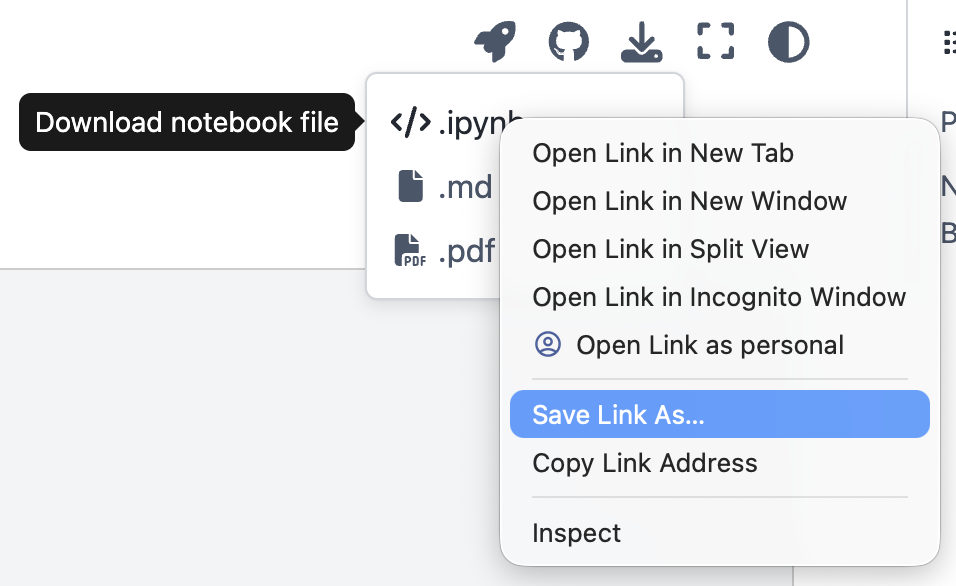

********************************************************************************
  pyGSTi 0.10
********************************************************************************

[](https://github.com/sandialabs/pyGSTi/actions/workflows/beta-master.yml)
[](https://github.com/sandialabs/pyGSTi/actions/workflows/develop.yml)
[](https://github.com/sandialabs/pyGSTi/actions/workflows/beta-master.yml)

pyGSTi
------
**pyGSTi** is open-source software for *modeling and characterizing noisy quantum information processors*
(QIPs), i.e., systems of one or more qubits.  It is licensed under the Apache License, Version 2.0.
Copyright information can be found in ``NOTICE``, and the license itself in ``LICENSE``.

There are three main objects in pyGSTi:
- `Circuit`: a quantum circuit (can have many qubits).
- `Model`: a description of a QIP's gate and SPAM operations (a noise model).
- `DataSet`: a dictionary-like container holding experimental data.

You can do various things with these objects:

- **Circuit simulation**: compute the outcome probabilities of a `Circuit` using a `Model`.
- **Data simulation**: simulate experimental data (a `DataSet`) using a `Model`.
- **Model testing**: Test whether a given `Model` fits the data in a `DataSet`.
- **Model estimation**: Estimate a `Model` from a `DataSet` (e.g. using GST).
- **Model-less characterization**: Perform Randomized Benchmarking on a `DataSet`.

In particular, there are a number of characterization protocols currently implemented in pyGSTi:
- **Gate Set Tomography (GST)** is the most complex and is where the software derives its name
 (a "python GST implementation").
- **Randomized Benchmarking (RB)** is a well-known method for assessing the
 quality of a QIP in an average sense.  PyGSTi implements standard "Clifford" RB
 as well as the more scalable "Direct" RB methods.
- **Robust Phase Estimation (RPE)** is a method designed for quickly learning
 a few noise parameters of a QIP that are particularly useful for tuning up qubits.

PyGSTi is designed with a modular structure so as to be highly customizable
and easily integrated with new or existing python software.  It runs using
python 3.10 or higher.  To facilitate integration with software for running
cloud-QIP experiments, pyGSTi `Circuit` objects can be converted to IBM's
**OpenQASM** and Rigetti Quantum Computing's **Quil** circuit description languages.

Installation
------------
Apart from several optional Cython modules, pyGSTi is written entirely in Python.
To install pyGSTi and only its required dependencies run:

``pip install pygsti``

**Or**, to install pyGSTi with all its optional dependencies too, run:

``pip install pygsti[complete]``

**Alternatively**, you can install pyGSTi from source using the following commands:

~~~
cd <install_directory>
git clone https://github.com/sandialabs/pyGSTi.git
cd pyGSTi
pip install -e .[complete]
~~~

Any of the above installations *should* build the set of optional Cython extension modules if a working C/C++ compiler and the `Cython` package are present.

If you installed from source then you have the option of (re)building Cython extensions at any time.
You can do that by running `python setup.py build_ext --inplace`.

Finally, [Jupyter notebook](http://jupyter.org/) is highly recommended as
it is generally convenient and the format of the included tutorials and
examples.  It is installed automatically when `[complete]` is used, otherwise
it can be installed separately.

Getting Started
---------------
Here are a couple of simple examples to get you started.

#### Circuit simulation
To compute the outcome probabilities of a circuit, you just need to create
a `Circuit` object (describing your circuit) and a `Model` object containing
the operations contained in your circuit.  Here we use a "stock" single-qubit `Model`
containing an unlabeled *Idle* gate along with *X(&pi;/2)* and *Y(&pi;/2)* gates
labelled `Gxpi2` and `Gypi2`, respectively:
~~~
import pygsti
from pygsti.modelpacks import smq1Q_XYI

mycircuit = pygsti.circuits.Circuit([('Gxpi2',0), ('Gypi2',0), ('Gxpi2',0)])
model = smq1Q_XYI.target_model()
outcome_probabilities = model.probabilities(mycircuit)
~~~


#### Gate Set Tomography
Gate Set Tomography is used to characterize the operations performed by
hardware designed to implement a (small) system of quantum bits (qubits).
Here's the basic idea:

  1. you tell pyGSTi what gates you'd ideally like to perform
  2. pyGSTi tells you what circuits it wants data for
  3. you perform the requested experiments and place the resulting
     data (outcome counts) into a text file that looks something like this:

     ```
     ## Columns = 0 count, 1 count
     {} 0 100  # the empty sequence (just prep then measure)
     Gx 10 90  # prep, do an X(pi/2) gate, then measure
     GxGy 40 60  # prep, do an X(pi/2) gate followed by a Y(pi/2), then measure
     Gx^4 20 80  # etc...
     ```

  4. pyGSTi takes the data file and outputs a "report" - currently
     an HTML web page.

In code, running GST looks something like this:
~~~
import pygsti
from pygsti.modelpacks import smq1Q_XYI

# 1) get the ideal "target" Model (a "stock" model in this case)
mdl_ideal = smq1Q_XYI.target_model()

# 2) generate a GST experiment design
edesign = smq1Q_XYI.create_gst_experiment_design(4) # user-defined: how long do you want the longest circuits?

# 3) write a data-set template
pygsti.io.write_empty_dataset("MyData.txt", edesign.all_circuits_needing_data, "## Columns = 0 count, 1 count")

# STOP! "MyData.txt" now has columns of zeros where actual data should go.
# REPLACE THE ZEROS WITH ACTUAL DATA, then proceed with:
ds = pygsti.io.load_dataset("MyData.txt") # load data -> DataSet object

# OR: Create a simulated dataset with:
# ds = pygsti.data.simulate_data(mdl_ideal, edesign, num_samples=1000)

# 4) run GST (now using the modern object-based interface)
data = pygsti.protocols.ProtocolData(edesign, ds) # Step 1: Bundle up the dataset and circuits into a ProtocolData object
protocol = pygsti.protocols.StandardGST() # Step 2: Select a Protocol to run
results = protocol.run(data) # Step 3: Run the protocol!

# 5) Create a nice HTML report detailing the results
report = pygsti.report.construct_standard_report(results, title="My Report", verbosity=1)
report.write_html("myReport", auto_open=True, verbosity=1) # Can also write out Jupyter notebooks!
~~~

Documentation
-------------
There are numerous tutorials and examples in the `pyGSTi/docs` directory. These are stored as MyST Markdown
for version control convenience, but can be converted to Jupyter notebooks as needed using Jupytext.

### Viewing the documentation *online*
The recommended way to view the documentation is on [ReadTheDocs](https://pygsti.readthedocs.io/en/latest/),
although the raw Markdown files can also be looked at on [GitHub](https://github.com/sandialabs/pyGSTi/blob/master/docs/markdown/intro.md).

The site renders the source MyST Markdown without executing notebook cells, so you won't see outputs (plots, tables) inline.
You can download the notebooks or run them on the cloud with buttons in the upper-right of the given page.

- **Download icon → ipynb, md, or pdf.** If you just click the `.ipynb` or `.md` options then the source will open as raw text in a new tab.
If you want to save those files you need to **right click the desired format and select `Save Link As ...`**, then enter the file name with the appropriate extension.
Here's a screenshot of what that can look like.

  

- **Rocket icon → Binder or Colab:** launches a fully-provisioned notebook environment in your browser with no local install. Right now this is clunky and not recommended.

### Running notebooks *locally*
It can be convenient to just build and run the tutorials locally.
We can do this using Jupytext for conversion and then start a Jupyter notebook or JupyterLab server to run the notebooks.
Assuming you've followed the *local installation* directions above:

* Change to the docs directory, by running:
    ``cd docs``

* Build the notebooks from their Markdown sources, by running:
    ``jupytext --to notebook markdown/**/*.md`` 
  This writes an `.ipynb` next to each `.md` under `markdown/`.

* Start up the Jupyter notebook server by running ``jupyter notebook`` or a JupyterLab server by running ``jupyter lab``.

The Jupyter server should open up your web browser to the server root, from
where you can start the first `markdown/intro.ipynb` notebook.  Note that the key
command to execute a cell within the Jupyter notebook is ``Shift+Enter``, not
just ``Enter``.

### Building the web documentation *locally*
The web docs are built using [Jupyter Book v1](https://jupyterbook.org). Note: v2 is a separate product that doesn't support our autodoc-based API reference yet, so we pin `jupyter-book<2`.

**WARNING.** Building the web docs takes a LONG TIME, because they include a very large **API Reference**.
If you only want to read or work with the tutorials and examples, don't do a full build — just convert and [run the notebooks directly](#running-notebooks-locally).

To install the build dependencies along with pyGSTi:
    ``pip install -e .[docs]``

then build:
    ``jb build docs``

Then open `docs/_build/html/index.html` in a web browser to look through the documentation.

### Contributing notebook changes
**Only the `docs/markdown/*.md` files are version-controlled.** The paired `.ipynb` files — generated next to
each `.md` under `docs/markdown/` — are gitignored build artifacts. The canonical source is the `.md` file, and
edits there "win" on the next sync. So:

- If you find it more convenient to edit the `.ipynb` (e.g. for interactive iteration), **sync your edits back to
  Markdown before committing**: from the `docs/` folder run `jupytext --sync markdown/**/*.md`, then commit the updated `.md`.
- If you edit a `.ipynb` and forget to sync, your changes will be silently overwritten the next time anyone runs the sync. When in doubt, edit the `.md`.

A few other gotchas worth knowing when editing the MyST sources:

- **Block math (`$$...$$`) needs blank lines around it.** A single `$` is inline math; multiple `$$` blocks crammed
  against surrounding text get parsed as inline math chains and render incorrectly.
- **Don't change `kernelspec.name` away from `python3`** when adding a new file. Jupyter writes the local conda
  env name into the notebook metadata; that name then propagates through `jupytext --sync` and breaks execution on
  anyone else's machine.
- **Adding a new tutorial** requires editing `docs/_toc.yml` to slot the new file into the navigation.

License
-------
PyGSTi is licensed under the [Apache License Version 2.0](https://github.com/sandialabs/pyGSTi/blob/master/LICENSE).


Questions?
----------
For help and support with pyGSTi, please contact the authors at
pygsti@sandia.gov.

How To Cite pyGSTi
------------------

If you've used pyGSTi in the your research and are interested in citing
us, please consider the following software design paper from some of the
members of our development team (bibtex below):

```
@ARTICLE{Nielsen2020-rd,
  title     = "Probing quantum processor performance with {py{GST}i}",
  author    = "Nielsen, Erik and Rudinger, Kenneth and Proctor, Timothy and
              Russo, Antonio and Young, Kevin and Blume-Kohout, Robin",
  journal   = "Quantum Sci. Technol.",
  publisher = "IOP Publishing",
  volume    =  5,
  number    =  4,
  pages     = "044002",
  month     =  jul,
  year      =  2020,
  url       = "https://iopscience.iop.org/article/10.1088/2058-9565/ab8aa4",
  copyright = "http://iopscience.iop.org/page/copyright",
  issn      = "2058-9565",
  doi       = "10.1088/2058-9565/ab8aa4"
}
```