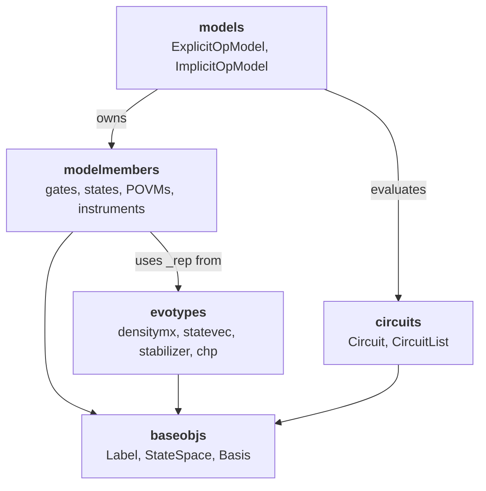

# 01 — Representation

**Covers:** [pygsti/baseobjs/](../pygsti/baseobjs/), [pygsti/circuits/](../pygsti/circuits/), [pygsti/models/](../pygsti/models/), [pygsti/modelmembers/](../pygsti/modelmembers/), [pygsti/evotypes/](../pygsti/evotypes/).

## What lives here

This is where pyGSTi's data model is defined: the objects that describe a (possibly noisy) quantum device, the program (circuit) that runs on it, and the lower-level primitives both depend on. Five subpackages collaborate:

- [`baseobjs`](../pygsti/baseobjs/) — primitives that everything else uses: [`Label`](../pygsti/baseobjs/label.py), [`StateSpace`](../pygsti/baseobjs/statespace.py), [`Basis`](../pygsti/baseobjs/basis.py), `NicelySerializable`, etc. Conceptually tier-0 infrastructure.
- [`circuits`](../pygsti/circuits/) — [`Circuit`](../pygsti/circuits/circuit.py) and helpers for constructing circuit families (germs, fiducials, lsgst lists).
- [`models`](../pygsti/models/) — [`Model`](../pygsti/models/model.py), [`ExplicitOpModel`](../pygsti/models/explicitmodel.py), [`ImplicitOpModel`](../pygsti/models/implicitmodel.py), and the [`LayerRules`](../pygsti/models/layerrules.py) machinery for assembling layer operations.
- [`modelmembers`](../pygsti/modelmembers/) — the heart of the parameter system: gates (operations), state preparations, POVMs, instruments, and the error-generator machinery that parameterizes noise. This is the biggest subpackage in the repo (~27k lines, ~98 classes).
- [`evotypes`](../pygsti/evotypes/) — *how* representations are stored under the hood: superoperator matrices on density matrices (`densitymx`), unitaries on state vectors (`statevec`), symplectic tableaux (`stabilizer`), or CHP commands (`chp`). Each evotype has a compiled C extension and a `_slow` pure-Python fallback (except `chp`).

If you're adding/changing a **gate parameterization, state, POVM, or instrument** — or touching how Models store and lay out parameters — you're here.

## Mental model

There are five ideas you need to hold in your head before reading any of this code.

### 1. A `Model` is a parameter vector plus a tree of `ModelMember`s, plus an attached forward simulator

A [`Model`](../pygsti/models/model.py#L46) owns a flat parameter vector (`_paramvec`) and a tree of [`ModelMember`](../pygsti/modelmembers/modelmember.py#L109) objects. Each member claims a slice of the parameter vector via its `gpindices` (global parameter indices) attribute. When the optimizer perturbs the parameter vector, the Model pushes new values into each member.

A given Model typically has an attached **forward simulator** at `model.sim`. The simulator handles outcome-probability computation, layout allocation, and MPI sharding. Don't think of the Model as a passive container — most Model-level operations (computing outcomes, computing derivatives) are actually delegated to `model.sim`. Doc 02 covers the simulator side; the **invariant** to remember here is that `model.sim` and `sim.model` are paired pointers that must stay in sync at all times after the simulator is attached (see the gotchas section).

### 2. A `Circuit` is a (possibly empty) sequence of `Label`s; `Label` is a polymorphic family

A [`Circuit`](../pygsti/circuits/circuit.py#L222) is a sequence of `Label` objects. A `Label` can represent an individual gate, a parallel layer of gates, a nested sub-circuit, a state-prep marker, or a measurement marker. There are many distinct `Label` subclasses, all defined in [pygsti/baseobjs/label.py](../pygsti/baseobjs/label.py):

| Class | Line | Use |
|---|---|---|
| [`Label`](../pygsti/baseobjs/label.py#L31) | 31 | Abstract base / factory; the `Label(...)` constructor dispatches to the appropriate subclass. |
| [`LabelTup`](../pygsti/baseobjs/label.py#L305) | 305 | A single gate label like `('Gx', 0)` — name plus state-space labels (`sslbls`). |
| [`LabelTupWithTime`](../pygsti/baseobjs/label.py#L551) | 551 | Same, with an associated time value. |
| [`LabelStr`](../pygsti/baseobjs/label.py#L735) | 735 | A pure-string label (no `sslbls`). |
| [`LabelTupTup`](../pygsti/baseobjs/label.py#L950) | 950 | A *layer* label — a tuple of parallel gate labels applied in one time step. |
| [`LabelTupTupWithTime`](../pygsti/baseobjs/label.py#L1207) | 1207 | Layer with an associated time. |
| [`CircuitLabel`](../pygsti/baseobjs/label.py#L1373) | 1373 | A label that wraps a sub-circuit (used for repetition and compilation). |
| [`LabelTupWithArgs`](../pygsti/baseobjs/label.py#L1625) | 1625 | A gate label with additional positional args (e.g., a rotation angle). |
| [`LabelTupTupWithArgs`](../pygsti/baseobjs/label.py#L1849) | 1849 | Layer-with-args. |

Resist the temptation to describe Circuits as 2-D arrays of gates. Layers can be `LabelTupTup`s that contain heterogeneous parallel ops, sub-circuits via `CircuitLabel`, or pure strings. The internal representation is more like a tagged sequence than a rectangular grid.

**Idle gates / idle layers are tricky.** A Circuit can represent "do nothing on every line for one time step" in at least three different ways:

- An **empty layer** — `LabelTupTup(())` or equivalent.
- An **explicit idle gate** — e.g., `Label('Gi')` (no `sslbls`) or `Label('Gi', sslbls=(0,))`.
- A **`None`-`sslbls`** operation that conventionally acts on all lines.

Different code paths treat these differently. If you're writing code that walks Circuits and looks at idles, test all three forms.

### 3. `Evotype` is the representation-strategy pluggable, and it's tightly coupled to parameterization

An [`Evotype`](../pygsti/evotypes/evotype.py#L9) is fixed at Model construction and decides how Liouvillian superoperators (and the vectors they act on) are stored in memory:

- `densitymx` — full superoperator matrices acting on density-matrix vectors in some basis (Pauli, Gell-Mann, etc.).
- `statevec` — unitaries acting on Hilbert-space state vectors.
- `stabilizer` — symplectic tableaux for stabilizer-friendly Clifford circuits.
- `chp` — a non-storage evotype that emits CHP simulator commands.

The evotype, the modelmember parameterization, and the forward simulator are **extremely tightly coupled**. A `LindbladErrorgen` only makes sense in a `densitymx` evotype (it's a superoperator). A `StaticCliffordOp` only makes sense in `stabilizer`. Wrong combinations either fail at construction time or silently degrade performance (one of the operations falls back to a generic dense form that defeats the optimization the evotype was supposed to enable).

**Tweak evotypes with caution.** Changes here directly affect forward-simulation time, which directly affects GST fit speed. Changes here should be evaluated against performance profiling in GST fits. The precise profiling needs to be determined in concert with the human at the wheel.

### 4. `Basis` and `StateSpace` are orthogonal descriptors

- [`StateSpace`](../pygsti/baseobjs/statespace.py#L22) describes *what state space exists*: how many qudits, of what dimension, with what labels. Concrete subclasses include [`QuditSpace`](../pygsti/baseobjs/statespace.py#L657), [`QubitSpace`](../pygsti/baseobjs/statespace.py#L869), and [`ExplicitStateSpace`](../pygsti/baseobjs/statespace.py#L1044). **pyGSTi is not qubit-only** — `QuditSpace` is a first-class concept. At the same time, there are surely bugs in pyGSTi that only show up when someone tries to use qudits. These bugs should be fixed immediately after they're found.
- [`Basis`](../pygsti/baseobjs/basis.py#L59) describes *what coordinate system the matrices are written in*: Pauli-product, Gell-Mann, std (computational), etc. Standard subclasses include [`BuiltinBasis`](../pygsti/baseobjs/basis.py#L1063), [`ExplicitBasis`](../pygsti/baseobjs/basis.py#L851), and [`DirectSumBasis`](../pygsti/baseobjs/basis.py#L1213). The first of these can be specified with a string literal like `'pp'` or `'gm'`, and is why type annotations with Basis objects should really use BasisLike (a small union type).

Code that reconstructs a gate from a dense matrix must receive *both* a `StateSpace` and a `Basis` to unambiguously invert the representation. Confusing the two can create

### 5. `ExplicitOpModel` vs. `ImplicitOpModel` is a real fork in the road

[`ExplicitOpModel`](../pygsti/models/explicitmodel.py) stores one explicit `ModelMember` per gate label, per prep label, per POVM label. Layer operations are computed by composing members in order. This is the form most pyGSTi tutorials use.

[`ImplicitOpModel`](../pygsti/models/implicitmodel.py) stores building blocks — single-qudit gates, two-qudit gates, idle channels, etc. — and constructs layer operations on the fly via a set of [`LayerRules`](../pygsti/models/layerrules.py#L18). This is what you use for n-qudit noise models where enumerating every layer would be combinatorial overkill.

**ImplicitOpModel is rapidly increasing in importance.** Most existing pyGSTi user-facing docs focus on ExplicitOpModel because that's where GST historically lived, but ImplicitOpModel is what scales. If you're touching n-qudit code, expect ImplicitOpModel, expect to interact with `LayerRules`, and don't assume the ExplicitOpModel patterns carry over.

## Key abstractions

Here are the names that come up over and over again in the subpackage. Use this table as your cheat sheet.

| Class / function | File | Role |
|---|---|---|
| [`Label`](../pygsti/baseobjs/label.py#L31) (and subclasses above) | [baseobjs/label.py](../pygsti/baseobjs/label.py) | Polymorphic identifiers for gates, layers, sub-circuits, SPAM. |
| [`StateSpace`](../pygsti/baseobjs/statespace.py#L22) / [`QubitSpace`](../pygsti/baseobjs/statespace.py#L869) / [`QuditSpace`](../pygsti/baseobjs/statespace.py#L657) | [baseobjs/statespace.py](../pygsti/baseobjs/statespace.py) | What state space exists. |
| [`Basis`](../pygsti/baseobjs/basis.py#L59) / [`BuiltinBasis`](../pygsti/baseobjs/basis.py#L1063) | [baseobjs/basis.py](../pygsti/baseobjs/basis.py) | Coordinate system for matrices. |
| [`Circuit`](../pygsti/circuits/circuit.py#L222) | [circuits/circuit.py](../pygsti/circuits/circuit.py) | A program: sequence of `Label`s, plus line labels and metadata. |
| [`Model`](../pygsti/models/model.py#L46), [`OpModel`](../pygsti/models/model.py#L397) | [models/model.py](../pygsti/models/model.py) | Abstract Model + the operation-Model intermediate base. |
| [`ExplicitOpModel`](../pygsti/models/explicitmodel.py) | [models/explicitmodel.py](../pygsti/models/explicitmodel.py) | Explicit dict of ops/preps/POVMs/instruments. |
| [`ImplicitOpModel`](../pygsti/models/implicitmodel.py) | [models/implicitmodel.py](../pygsti/models/implicitmodel.py) | Building-block model with layer composition rules. |
| [`LayerRules`](../pygsti/models/layerrules.py#L18) | [models/layerrules.py](../pygsti/models/layerrules.py) | Critical for ImplicitOpModel — how to build a layer op from member ops. |
| [`ModelMember`](../pygsti/modelmembers/modelmember.py#L109) | [modelmembers/modelmember.py](../pygsti/modelmembers/modelmember.py) | Abstract base: a parameterized object with `gpindices`, `evotype`, `state_space`. |
| [`LinearOperator`](../pygsti/modelmembers/operations/linearop.py#L48) | [modelmembers/operations/linearop.py](../pygsti/modelmembers/operations/linearop.py) | Base class for all gates. |
| [`LindbladErrorgen`](../pygsti/modelmembers/operations/lindbladerrorgen.py#L40) | [modelmembers/operations/lindbladerrorgen.py](../pygsti/modelmembers/operations/lindbladerrorgen.py) | The error generator that powers CPTP-friendly noise modeling. |
| [`ExpErrorgenOp`](../pygsti/modelmembers/operations/experrorgenop.py#L34) | [modelmembers/operations/experrorgenop.py](../pygsti/modelmembers/operations/experrorgenop.py) | Wraps an error generator into a CPTP gate via matrix exponential. |
| `FullArbitraryOp`, `FullTPOp`, `StaticArbitraryOp`, `StaticCliffordOp`, `StaticUnitaryOp`, `ComposedOp`, `DepolarizeOp`, etc. | [modelmembers/operations/](../pygsti/modelmembers/operations/) | Concrete gate parameterizations (full / TP / static / Clifford / composed / specialized). |
| `FullState`, `TPState`, `StaticState`, `ComposedState`, `ComputationalState` | [modelmembers/states/](../pygsti/modelmembers/states/) | State-preparation parameterizations. |
| [`POVM`](../pygsti/modelmembers/povms/povm.py#L60), `UnconstrainedPOVM`, `TPPOVM`, `ComputationalBasisPOVM`, `MarginalizedPOVM`, `ComposedPOVM` | [modelmembers/povms/](../pygsti/modelmembers/povms/) | Measurement parameterizations. The `POVM` base has known structural issues — see [known-debt.md](known-debt.md#17-povm-inheritance-structure-refactor). |
| [`Instrument`](../pygsti/modelmembers/instruments/instrument.py#L26), `TPInstrument` | [modelmembers/instruments/](../pygsti/modelmembers/instruments/) | Quantum instruments (mid-circuit conditional ops with classical outcomes). |
| [`Evotype`](../pygsti/evotypes/evotype.py#L9) | [evotypes/evotype.py](../pygsti/evotypes/evotype.py) | Representation-strategy factory. |
| [`ModelMemberGraph`](../pygsti/modelmembers/modelmembergraph.py) | [modelmembers/modelmembergraph.py](../pygsti/modelmembers/modelmembergraph.py) | DAG of member dependencies for serialization. |

## Cross-subpackage relationships

Reading arrows as **"uses"**:

| Subpackage | Depends on | Notes |
|---|---|---|
| `baseobjs` | — | Tier 0. Everything else uses `Label`, `StateSpace`, `Basis`. |
| `circuits` | `baseobjs` | A `Circuit` is a sequence of `Label`s. |
| `evotypes` | `baseobjs` | Factory for evotype-specific `_rep` objects sized by `StateSpace` + `Basis`. |
| `modelmembers` | `baseobjs`, `evotypes` | Members own an opaque `_rep` from the evotype; member code uses **duck typing** on it (no shared base class across evotypes). |
| `models` | `baseobjs`, `circuits`, `modelmembers` | A `Model` owns members and evaluates `Circuit`s via its attached `ForwardSimulator`. |

A few notes on the structure:

- `baseobjs` is the bottom of the stack and has a known **circular-import wrinkle** with `protocols` ([known-debt.md #3](known-debt.md#3-baseobjs--protocols-circular-import)) sidestepped today by deferred imports — you'll trip on it if you rearrange imports in `baseobjs`.
- `evotypes` is orthogonal to `modelmembers` but consumed by it. A member's `_rep` is *not* a polymorphic class hierarchy; it's whatever the evotype hands back, and member code interacts with it by duck typing.
- Above this layer: `protocols`, `drivers`, `report`, etc. all depend on `models`. They are covered in docs 03, 04, 05.

## The CPTPLND deep-dive

`"CPTPLND"` is the parameterization mode you should expect to see when CPTP modeling is being done seriously. It composes three layers:

1. Each **gate** becomes a [`ComposedOp`](../pygsti/modelmembers/operations/composedop.py#L33), whose constituents are some kind of ideal static operator (e.g., [`StaticUnitaryOp`](../pygsti/modelmembers/operations/staticunitaryop.py#L21)) and a parameterized [`ExpErrorgenOp`](../pygsti/modelmembers/operations/experrorgenop.py#L34) error channel. The latter wraps a [`LindbladErrorgen`](../pygsti/modelmembers/operations/lindbladerrorgen.py#L40), which is parameterized by Lindbladian coefficients (Hamiltonian, stochastic, affine, and other blocks per [`LindbladCoefficientBlock`](../pygsti/modelmembers/operations/lindbladcoefficients.py)). Applying `exp` to the error generator gives a guaranteed-CPTP gate.

2. Each **state prep** becomes a [`ComposedState`](../pygsti/modelmembers/states/composedstate.py) of a "perfect" prep with a `LindbladErrorgen`-driven noisy operation. Each **POVM** becomes a [`ComposedPOVM`](../pygsti/modelmembers/povms/composedpovm.py) with the same pattern.

3. The composition produces a representation in which **noisy SPAM is "perfect SPAM composed with a noisy gate."**

The third layer has a non-obvious consequence: **representation degeneracies in state prep** (and to a lesser extent measurement). Multiple distinct parameter-vector values can map to the same physical noisy SPAM, because what you're modeling is the *combined* prep-plus-noisy-op, and the split between "ideal prep" and "noisy op" is non-unique. This is a sort of "gauge freedom" (although not the kind relevant to gauge optimization). If you're debugging a fit and SPAM's contributions to the parameter vector look weird, this might be why.

**Instruments** extend the same pattern to mid-circuit measurements. Each member factors as a measurement effect followed by a post-measurement CPTP gate, `I_k(ρ) = G_k(E_k^½ ρ E_k^½)` with `E_k = I_k†(I)`, and is represented as a single `ComposedOp([RootConjOperator(E_k), G_k])`. The effects `{E_k}` are gathered into one shared [`ComposedPOVM`](../pygsti/modelmembers/povms/composedpovm.py) — its completeness `Σ_k E_k = I` is exactly the instrument's joint trace preservation — and each `G_k` is parameterized independently (a CP-constrained `G_k` makes *that member* CP). Build these with the classmethods `Instrument.from_effects` / `Instrument.from_cptr_superops` (logic in [`modelmembers/instruments/_construction.py`](../pygsti/modelmembers/instruments/_construction.py)), or reach them via `convert(instrument, 'CPTPLND', basis)` / `set_all_parameterizations('CPTPLND')`. An n-outcome instrument needs only **n effects and n gates**. Note the shared-POVM layout makes the *later* members' parameter indices **non-contiguous** (they share the early POVM indices but own late gate indices); this is handled, but it's why `_submember_rpindices` can be an array rather than a slice.

## Pitfalls and gotchas

- **`gpindices` is the central glue.** Every `ModelMember` has a `gpindices` slice or array that says "I own indices `[a, b)` of the parent Model's `_paramvec`." A `gpindices` of `None` means "unallocated — will be assigned on add-to-model." Copying a member from one Model to another typically requires rebinding indices; `Model._rebuild_paramvec()` is the canonical way to force a fresh allocation.

- **Evotype mismatch is a silent footgun.** Adding a `densitymx` operation to a `statevec` Model usually doesn't fail loudly. The operation just doesn't compose correctly with the rest of the model's reps.

- **Model ↔ simulator synchronization invariant.** Once a simulator is attached, the pair `model.sim` ↔ `sim.model` must remain mutually consistent at all times. The only exception is the brief construction window before a simulator has been assigned. Code that copies models, swaps simulators, or serializes/deserializes must preserve this invariant; doc 02 covers the simulator side.

- **`prefer_dense_reps`.** [`Evotype.cast`](../pygsti/evotypes/evotype.py#L59) takes a `prefer_dense_reps` knob that decides whether composed/embedded structural reps get collapsed into dense matrices. The default heuristic depends on `state_space.dim`. Forcing dense reps speeds up small problems but defeats the structural optimizations that make composed operations efficient at scale.

- **Parameter re-allocation after structural mutation.** If you mutate a POVM's effect dict or an Instrument's outcome dict *after* adding the parent to a Model, `gpindices` does **not** automatically re-allocate. Call `Model._rebuild_paramvec()` afterward. The most common trigger to `_rebuild_paramvec()` is **changing parameterization in place** — e.g., `model.set_all_parameterizations('CPTPLND')` after constructing in `'full'`. This tears down the member tree, reallocates indices, and the new parameter vector is generally a different length than the old one.

- **`ModelMemberGraph` is easy to overlook.** [`ModelMemberGraph`](../pygsti/modelmembers/modelmembergraph.py) tracks the dependency DAG between members for serialization. Most code can ignore it. When something fails to round-trip through `meta.json`-style serialization, this is the place to start.

- **CPTPLND representation degeneracies** — see the deep-dive above.

- **Cython `_slow` fallback applies here.** See [AGENTS.md](AGENTS.md#cython-_slow-fallback). If forward-sim performance is surprising in either direction, check which `_rep` class actually got instantiated — the C extension and the `_slow` numpy path can win on different workloads ([#713](https://github.com/sandialabs/pyGSTi/issues/713)).

- **Idle-gate ambiguity in Circuits.** See mental-model section 2 above.

## Architectural debt

- The `baseobjs` ↔ `protocols` circular import — [known-debt.md #3](known-debt.md#3-baseobjs--protocols-circular-import).
- POVM class hierarchy structural issues — [known-debt.md #17](known-debt.md#17-povm-inheritance-structure-refactor) and [sandialabs/pyGSTi#727](https://github.com/sandialabs/pyGSTi/issues/727).
- `tools/leakage.py` is a complete domain feature (with leakage-aware Model construction code) misfiled inside `tools` — [known-debt.md #2](known-debt.md#2-toolsleakagepy--pygstileakage-move).

## Canonical examples

Notebook sources under [docs/markdown/](../docs/markdown/) are useful teaching material, although they may be out-of-date.
Tests are mediocre as documentation; consult them only when you need to see actual API usage in isolation.

- [docs/markdown/objects/Circuit.md](../docs/markdown/objects/Circuit.md) — Circuit and Label semantics in depth.
- [docs/markdown/objects/ExplicitModel.md](../docs/markdown/objects/ExplicitModel.md), [ImplicitModel.md](../docs/markdown/objects/ImplicitModel.md) — Model variants.
- [docs/markdown/objects/Operators.md](../docs/markdown/objects/Operators.md) — gate parameterizations actually used in practice.
- [docs/markdown/objects/ModelParameterization.md](../docs/markdown/objects/ModelParameterization.md) — parameterization modes including CPTPLND.
- [docs/markdown/objects/ModelNoise.md](../docs/markdown/objects/ModelNoise.md) — noise composition patterns; SPAM noise modeling.
- [docs/markdown/objects/Instruments.md](../docs/markdown/objects/Instruments.md), [CustomOperator.md](../docs/markdown/objects/CustomOperator.md), [CustomPOVM.md](../docs/markdown/objects/CustomPOVM.md) — Instrument and custom-operator extension patterns.
- [docs/markdown/objects/ModelMemberGraph.md](../docs/markdown/objects/ModelMemberGraph.md), [StateSpace.md](../docs/markdown/objects/StateSpace.md), [MatrixBases.md](../docs/markdown/objects/MatrixBases.md) — supporting infrastructure.
- [docs/markdown/objects/ParameterLabels.md](../docs/markdown/objects/ParameterLabels.md), [ParameterBounds.md](../docs/markdown/objects/ParameterBounds.md) — parameter introspection.

Source-side anchor for "how do I construct an `ExplicitOpModel` from scratch": [pygsti/models/modelconstruction.py:59](../pygsti/models/modelconstruction.py#L59) and its `create_explicit_model_from_expressions` helper.
