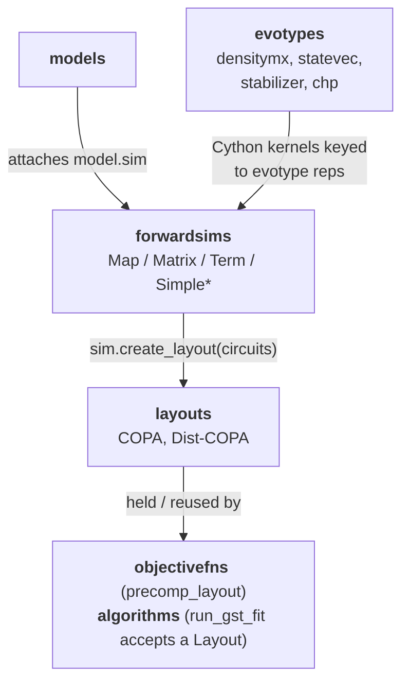

# 02 — Forward simulation

**Covers:** [pygsti/forwardsims/](../pygsti/forwardsims/), [pygsti/layouts/](../pygsti/layouts/).

Forward simulation is the speed-critical heart of every GST fit. It is also a first-class pyGSTi capability on its own: you can use pyGSTi purely as a circuit simulator without ever running a fit. This doc is sized for performance work, not just orientation.

## What lives here

- [`forwardsims/`](../pygsti/forwardsims/) — concrete forward-simulator implementations and the abstract base. Includes Cython kernels (`.pyx` files compiled to `.so`) for the high-throughput paths. (CHP-based stabilizer simulation is handled by the `chp` evotype's reps under [pygsti/evotypes/chp/](../pygsti/evotypes/chp/) rather than a dedicated simulator file.)
- [`layouts/`](../pygsti/layouts/) — `Layout` objects that index `(circuit, outcome) → flat array` *and* plan how circuits are processed in memory and across MPI ranks. Includes `evaltree`/`prefixtable` machinery for circuit-graph reuse.

If you're changing how outcomes are computed, how memory gets allocated, or how work is sharded — you're here.

## Mental model

### 1. A `ForwardSimulator` implements `Model.sim`

[`ForwardSimulator`](../pygsti/forwardsims/forwardsim.py#L31) takes a Model and a Circuit (or `CircuitList`) and returns outcome probabilities, plus derivatives with respect to model parameters when requested. The simulator is *attached* to a Model via the `model.sim` attribute, and the simulator carries a back-pointer at `sim.model`.

**The pair `model.sim` ↔ `sim.model` must stay in sync at all times after construction.** This is one of pyGSTi's load-bearing invariants. Code that copies models, swaps simulators, serializes/deserializes, or otherwise restructures objects must preserve it. The only exception is the brief construction window before a simulator has been attached.

A Model can swap simulators at runtime — `model.sim = new_sim` — but doing so updates both pointers.

### 2. A `Layout` is an *index plus a memory plan*

[`CircuitOutcomeProbabilityArrayLayout`](../pygsti/layouts/copalayout.py#L27) (commonly abbreviated COPA layout in code) is two things at once:

1. **An index.** It maps `(circuit, outcome_label) → flat-array-index` so that downstream code can treat all outcome probabilities as a single 1-D vector. The objective function consumes this 1-D vector; the optimizer never sees Circuits.
2. **A memory plan.** It groups circuits that share prefixes (so intermediate states can be reused), allocates scratch buffers for the forward-simulation algorithm, and — for distributed runs — partitions everything across MPI ranks. [`DistributableCOPALayout`](../pygsti/layouts/distlayout.py#L110) is the MPI-aware subclass; [`maplayout.py`](../pygsti/layouts/maplayout.py), [`matrixlayout.py`](../pygsti/layouts/matrixlayout.py), and [`termlayout.py`](../pygsti/layouts/termlayout.py) are simulator-specific variants. The [`evaltree.py`](../pygsti/layouts/evaltree.py) and [`prefixtable.py`](../pygsti/layouts/prefixtable.py) infrastructure is what implements the prefix-sharing.

The simulator calls `model.sim.create_layout(circuits, ...)` to build the layout for a given workload. The layout then gets reused across many objective-function evaluations during a fit — see "Layout sharing" below.

### 3. Simulator choice is a performance knob, not a correctness one

The same circuit-outcome probabilities come out of every simulator (modulo floating-point precision) unless otherwise stated (e.g., TermForwardSimulator). Different simulators trade speed for memory or specialize for particular evotypes.

## Simulator selection — current state

The recommended default is `'auto'`, which resolves to **`MapForwardSimulator`** unconditionally in current pyGSTi. The relevant code is [pygsti/forwardsims/forwardsim.py:62](../pygsti/forwardsims/forwardsim.py#L62) — `ForwardSimulator.cast(obj, num_qubits=...)` returns a `MapForwardSimulator()` for both `'auto'` and `'map'`.

| Simulator | When | Status |
|---|---|---|
| [`MapForwardSimulator`](../pygsti/forwardsims/mapforwardsim.py#L107) | The general-case workhorse. Repeated (possibly-sparse or structured) matrix-vector products on the state vector / density matrix. | **Recommended default.** Resolved-to by `'auto'`. |
| [`MatrixForwardSimulator`](../pygsti/forwardsims/matrixforwardsim.py#L631) | Dense process-matrix multiplication; composes a circuit-wide map and applies it. | **Largely obsoleted by MapForwardSimulator** — improvements to the Map simulator have eclipsed it for essentially every workload. Kept for backward compatibility. **Don't pick `'matrix'` in new code.** |
| [`TermForwardSimulator`](../pygsti/forwardsims/termforwardsim.py#L40) | Truncated path-integral / Taylor-expansion of each operation; works with `statevec` / `stabilizer` evotypes. | Specialized; rarely surfaced in user-facing examples. |
| [`SimpleMapForwardSimulator`](../pygsti/forwardsims/mapforwardsim.py#L41) | Non-distributable variant of MapForwardSimulator (no MPI). | Subclassed by `MapForwardSimulator`. |
| [`SimpleMatrixForwardSimulator`](../pygsti/forwardsims/matrixforwardsim.py#L45) | Non-distributable Matrix variant. | Subclassed by `MatrixForwardSimulator`. |
| `'chp'` simulator (via [pygsti/evotypes/chp/](../pygsti/evotypes/chp/)) | Hooks the external CHP program for stabilizer simulation. There is no dedicated `chpforwardsim.py` — selecting `'chp'` works through the regular `ForwardSimulator` infrastructure plus chp-evotype reps. | Specialized. |
| Cython kernels: [`mapforwardsim_calc_densitymx.pyx`](../pygsti/forwardsims/mapforwardsim_calc_densitymx.pyx), [`termforwardsim_calc_stabilizer.pyx`](../pygsti/forwardsims/termforwardsim_calc_stabilizer.pyx), [`termforwardsim_calc_statevec.pyx`](../pygsti/forwardsims/termforwardsim_calc_statevec.pyx) | C-extension hot paths. | Compiled at install time. |

### History note

Earlier versions of pyGSTi defaulted `'auto'` on a qubit-count rule (matrix for ≤2, map for ≥3), and several notebook passages and docstrings carried that wording long after the source code changed. The mismatched prose was corrected in commit `74133fc6f`. If you find residual mentions of the old rule, replace them with "`'auto'` selects `'map'`." Tracked in [known-debt.md #10](known-debt.md#10-matrixforwardsimulator-is-being-eclipsed-by-mapforwardsimulator).

## Key abstractions

| Class / function | File:line | Role |
|---|---|---|
| [`ForwardSimulator`](../pygsti/forwardsims/forwardsim.py#L31) | forwardsim.py:31 | Abstract base. `.model` back-pointer; `.cast(obj, num_qubits)` classmethod. |
| [`CacheForwardSimulator`](../pygsti/forwardsims/forwardsim.py#L798) | forwardsim.py:798 | Only used in SuccessFailForwardSimulator (extremely rare). |
| [`MapForwardSimulator`](../pygsti/forwardsims/mapforwardsim.py#L107) | mapforwardsim.py:107 | The recommended default. Structured matvecs on the evotype's representation of a state (usually densitymx). |
| [`MatrixForwardSimulator`](../pygsti/forwardsims/matrixforwardsim.py#L631) | matrixforwardsim.py:631 | Collapse all layers of a circuit into a single process matrix, then compose with SPAM to get the outcome probabilities. Legacy. |
| [`TermForwardSimulator`](../pygsti/forwardsims/termforwardsim.py#L40) | termforwardsim.py:40 | Truncated path-integral; statevec / stabilizer evotypes. |
| [`CircuitOutcomeProbabilityArrayLayout`](../pygsti/layouts/copalayout.py#L27) | copalayout.py:27 | The COPA layout — index plus memory plan. |
| [`DistributableCOPALayout`](../pygsti/layouts/distlayout.py#L110) | distlayout.py:110 | MPI-aware layout; carries the rank-partition plan. |
| Simulator-specific layouts | [`maplayout.py`](../pygsti/layouts/maplayout.py), [`matrixlayout.py`](../pygsti/layouts/matrixlayout.py), [`termlayout.py`](../pygsti/layouts/termlayout.py) | One per simulator; subclass COPA layout. |
| Prefix-sharing infrastructure | [`evaltree.py`](../pygsti/layouts/evaltree.py), [`prefixtable.py`](../pygsti/layouts/prefixtable.py) | Identifies shared circuit prefixes so partial results can be reused. |
| Cython kernels | [`mapforwardsim_calc_densitymx.pyx`](../pygsti/forwardsims/mapforwardsim_calc_densitymx.pyx) and friends | C hot paths for densitymx / statevec / stabilizer evotypes. |

## Cross-subpackage relationships

Reading arrows as **"uses"**:

The Layout is the *shared* artifact between forward sim and the fit loop. The simulator creates it once; the objective function reuses it across many evaluations.

## Pitfalls and gotchas

- **`model.sim` ↔ `sim.model` two-way sync.** Both pointers must always agree after the simulator is attached. The most common offenders are: code that copies a Model (must update `model_copy.sim.model = model_copy`), code that constructs a Simulator and never wires it up properly, and serialization that round-trips one half of the pair without the other.

- **Forward-simulator swap can change which fit-loop wrapper runs.** Most simulators (Map, Matrix, CHP) compute outcome probabilities essentially exactly, and the fit loop calls them through the generic [`_do_runopt`](../pygsti/algorithms/core.py#L1025). The `TermForwardSimulator` is different — its probabilities are an approximate truncated path integral that depends on which paths are retained — so the fit loop wraps it in [`_do_term_runopt`](../pygsti/algorithms/core.py#L1078), an outer loop that grows the path set between optimizer iterations until it's sufficient. If you swap to or from `TermForwardSimulator` mid-pipeline, you silently change which wrapper runs and pick up (or drop) that path-set machinery. See doc 03 for details.

- **Layout sharing across objective functions.** Iterative GST evaluates many objective functions sequentially over the same circuit family. Rebuilding the Layout for each iteration is wasteful. `ModelDatasetCircuitsStore.__init__()` ([`pygsti/objectivefns/objectivefns.py:936`](../pygsti/objectivefns/objectivefns.py#L936)) takes a `precomp_layout` kwarg that lets callers pass in a pre-built layout. Use it when you can.

- **Cython `_slow` fallback applies here.** The Map simulator's hot paths depend on `mapforwardsim_calc_densitymx.so` (and parallel Cython kernels for statevec/stabilizer Term sim). When the C build is missing, dispatch silently falls back to the Python `_slow` implementation. Don't assume that's slower — on some workloads / hardware (notably Apple Silicon, with many idle qubits) it has been measured to be *faster* than the C path ([#713 comment](https://github.com/sandialabs/pyGSTi/issues/713#issuecomment-4087958138)). The real gotcha is that the dispatch is silent, so you may not know which one your benchmark is exercising. See [AGENTS.md cross-cutting](AGENTS.md#cython-_slow-fallback) and [known-debt.md #11](known-debt.md#11-cython-extension-silent-fallback-to-_slow-python).

- **MPI plumbing.** `DistributableCOPALayout` carries a partition over the global outcome index. The simulator dispatches per-rank work via the partition; the objective function fills its 1-D output vector using only its rank's slice and then `Allreduce`s. Most code paths that involve `comm` are in [`distforwardsim.py`](../pygsti/forwardsims/distforwardsim.py) and [`distlayout.py`](../pygsti/layouts/distlayout.py).

## Architectural debt

- [Cython silent fallback to `_slow`](known-debt.md#11-cython-extension-silent-fallback-to-_slow-python).
- [#713](https://github.com/sandialabs/pyGSTi/issues/713) — efficiency of embedded ops in densitymx evotype(s), the most actively tracked forward-sim performance issue.

## Canonical examples

- [docs/markdown/Simulation.md](../pygsti-repo/docs/markdown/Simulation.md) — top-level intro.
- [docs/markdown/simulation/CircuitSimulation.md](../pygsti-repo/docs/markdown/simulation/CircuitSimulation.md) — circuit-simulation tutorial.
- [docs/markdown/simulation/ForwardSimulationTypes.md](../pygsti-repo/docs/markdown/simulation/ForwardSimulationTypes.md) — per-simulator detail.
