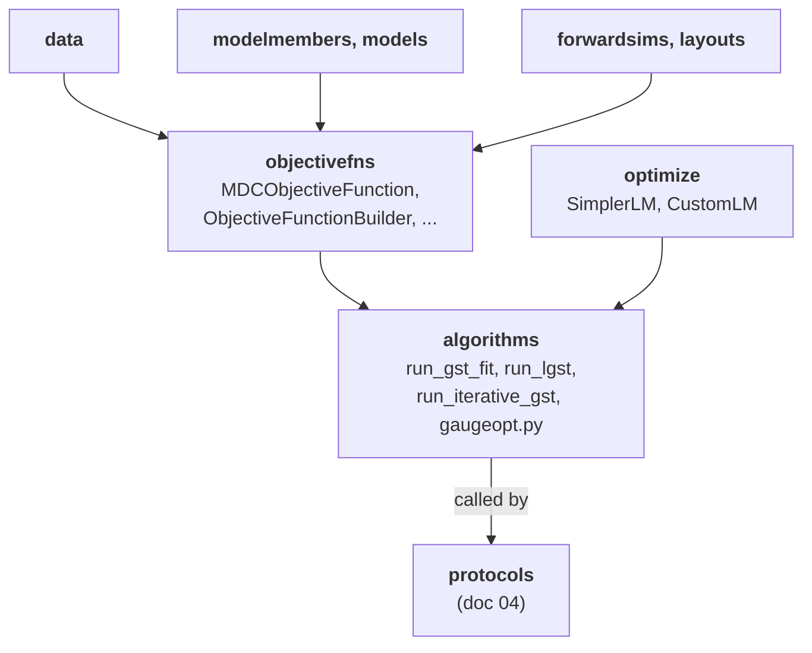

# 03 — Data and fitting

**Covers:** [pygsti/data/](../pygsti/data/), [pygsti/objectivefns/](../pygsti/objectivefns/), [pygsti/optimize/](../pygsti/optimize/), [pygsti/algorithms/](../pygsti/algorithms/).

## What lives here

- [`data/`](../pygsti/data/) — `DataSet` and its variants: containers for circuit-outcome counts (real or simulated).
- [`objectivefns/`](../pygsti/objectivefns/) — the objective functions a GST fit minimizes (chi-squared, log-likelihood, TVD, …) and their builders. Also houses the wildcard-budget machinery.
- [`optimize/`](../pygsti/optimize/) — the Levenberg–Marquardt solvers (and ancillary helpers) that do the actual numerical optimization.
- [`algorithms/`](../pygsti/algorithms/) — *stateless kernels* that wire these together: `run_gst_fit`, `run_lgst`, `run_iterative_gst`, fiducial selection, germ selection, gauge optimization.

If you're changing how data is stored, how a fit's objective behaves, how the optimizer works, or how `algorithms/` ties them together — you're here. **Orchestration on top of these kernels** (`Protocol` classes that bundle iteration, gauge opt, bad-fit handling, checkpointing) lives in doc 04.

## Mental model

### 1. The fit is a three-layer pipeline

The `MDCObjectiveFunction` (Model+Dataset+Circuits objective) packages everything the optimizer needs: a Model whose parameter vector is the optimization variable, a DataSet whose counts define the loss, a CircuitList over which the loss is summed, and a Layout that flattens it all into 1-D vectors. It exposes `.lsvec()` (the residual vector) and `.dlsvec()` (its Jacobian); the optimizer calls these thousands of times.

The optimizer ([`SimplerLMOptimizer`](../pygsti/optimize/simplerlm.py#L109)) is a Levenberg–Marquardt solver tuned for least-squares fits with thousands of parameters and tens of thousands of residuals. It treats the objective as a black box; all model/circuit awareness lives one layer up.

### 2. `algorithms/` is stateless kernels; `protocols/` is stateful orchestration

This split is the single most-asked architectural question by new contributors. The rule:

- **`algorithms/`** = pure functions that take inputs and return outputs. `run_gst_fit(mdc_store, optimizer, obj_fn_builder) → (opt_result, evaluated_obj_fn)`. No checkpointing, no gauge opt, no bad-fit handling, no result packaging — just "do one fit, return the result."
- **`protocols/`** (doc 04) = stateful classes that consume a `ProtocolData` and produce a serializable `ProtocolResults`. They call into `algorithms/` for the numerics and add the orchestration: gauge optimization, bad-fit detection, checkpointing, result-object construction.

If you're writing a custom workflow that just needs "fit this Model to this data" without all the bells, target the algorithms layer. If you need the bells, target a Protocol.

### 3. The optimizer choice is hidden from users

User-facing notebooks never surface `SimplerLMOptimizer` vs. `CustomLMOptimizer`. Protocol classes pick a sensible default. You should almost never need to change the optimizer — and when you do, **pick `SimplerLMOptimizer`** ([pygsti/optimize/simplerlm.py:109](../pygsti/optimize/simplerlm.py#L109)). `CustomLMOptimizer` is kept around only for backward compatibility; don't add new callers. See [known-debt.md #9](known-debt.md#9-customlmoptimizer-is-legacy-only).

## On `DataSet` (most of the data-layer airtime)

[`DataSet`](../pygsti/data/dataset.py#L807) is the container used in essentially every pyGSTi workflow. The other dataset variants exist for specialized cases and don't deserve significant developer attention compared to `DataSet`.

### What `DataSet` is

A dict-like map from `Circuit → {outcome_label: count}` plus metadata (collection times, comments, default counts). The natural mental model: an experimental data record indexed by circuit. The same shape is used for simulated data.

### Static vs. non-static

`DataSet` has a `static` mode. **Static = immutable, packed for efficiency.** Many code paths require `static=True` because they cache lookups; mutating a static dataset isn't supported. Construction typically goes:

1. Build a non-static `DataSet`, `add_counts_from_dataset(...)` or `add_count_dict(...)` row by row.
2. Call `.done_adding_data()` (or pass `static=True` at construction with all data up-front).
3. From then on, treat it as read-only.

### Outcome labels

Outcomes are tuples of single-line labels (`('0',)`, `('1', '0')`, etc.). The keys in the per-circuit dict are these tuples. Watch for `'0'` vs. `0` confusion at the boundaries — outcome labels are strings, not ints.

### `op_label_aliases` resolution

When constructing a DataSet whose circuits use one naming convention but the Model uses another, `op_label_aliases` lets you map between them. **Critically:** if a circuit in the DataSet doesn't match the Model after alias resolution, it gets silently dropped (or raises, depending on `action_if_missing`). Mismatches are not loud. If you're losing circuits unexpectedly, check the alias dict.

### Other dataset types (briefly)

- [`MultiDataSet`](../pygsti/data/multidataset.py) — a container of several `DataSet`s sharing the same circuit list (e.g., Monday's vs. Tuesday's data on the same experimental design). Specialized.
- [`FreeDataSet`](../pygsti/data/freedataset.py) — sparser, time-dependent data layout. Specialized.
- [`datacomparator.py`](../pygsti/data/datacomparator.py), [`hypothesistest.py`](../pygsti/data/hypothesistest.py) — statistical comparison utilities for two datasets.

For everything else, assume `DataSet`.

## The objective-function layer

[`MDCObjectiveFunction`](../pygsti/objectivefns/objectivefns.py#L1126) is the central abstraction. It multi-inherits `ObjectiveFunction` (the optimizer-facing interface) and [`EvaluatedModelDatasetCircuitsStore`](../pygsti/objectivefns/objectivefns.py#L1090) (the Model+Dataset+Circuits+Layout cache). The multi-inheritance is a known smell — see [known-debt.md #4](known-debt.md#4-mdcobjectivefunction-multi-inheritance-smell).

[`ObjectiveFunctionBuilder`](../pygsti/objectivefns/objectivefns.py#L127) constructs MDC objective functions for a given combination of (objective type, raw-objective parameters). Callers usually construct an `ObjectiveFunctionBuilder` once, then materialize concrete objective functions per iteration of an iterative fit.

The concrete time-independent objective types are subclasses of [`TimeIndependentMDCObjectiveFunction`](../pygsti/objectivefns/objectivefns.py#L4297):

| Subclass | File:line | Loss |
|---|---|---|
| [`Chi2Function`](../pygsti/objectivefns/objectivefns.py#L4965) | 4965 | Pearson chi-squared. |
| [`ChiAlphaFunction`](../pygsti/objectivefns/objectivefns.py#L4979) | 4979 | Power-α chi-squared variant. |
| [`FreqWeightedChi2Function`](../pygsti/objectivefns/objectivefns.py#L5006) | 5006 | Chi-squared with frequency weighting. |
| [`CustomWeightedChi2Function`](../pygsti/objectivefns/objectivefns.py#L5020) | 5020 | Chi-squared with user-specified weights. |
| (Plus log-likelihood / TVD variants) | various | See nearby classes. |

Each is built atop a "raw" formula class (e.g., [`RawChi2Function`](../pygsti/objectivefns/objectivefns.py#L1748), [`RawPoissonPicDeltaLogLFunction`](../pygsti/objectivefns/objectivefns.py#L2827)) that knows the mathematical loss in isolation, plus a wrapper that adds the Model+Dataset+Circuits scaffolding.

[`WildcardBudget`](../pygsti/objectivefns/wildcardbudget.py) is the **unmodeled-error budget** machinery. It is *not* a regularization device or an overfitting guard — it does not influence the fit at all. It runs *only when the primary fit already failed* to bring the model into statistical agreement with the data (i.e., the model is misspecified relative to what the experiment actually saw). The "robust" in `Robust-GST.md` and the "robust" connotation of `WildcardBudget` are a different sort of robustness: not "robust to overfitting" but "say something useful even when the standard fit is bad."

Mechanically: given a fitted Model, a wildcard budget assigns each primitive operation a non-negative number ("slack"). When computing predicted probabilities for a circuit, each outcome probability is allowed to move within an interval of total width equal to the sum of those slacks along the circuit. The optimizer in [`pygsti/optimize/wildcardopt.py`](../pygsti/optimize/wildcardopt.py) picks the *smallest* slack allocation (under an L1-style weighting) that makes the model+slack admissible against the data under chi-squared and per-circuit "red-box" thresholds. This is analogous to backward error in analysis of numerical algorithms.

The resulting `WildcardBudget` is recorded on the existing estimate as `Estimate.extra_parameters['unmodeled_error']`, with the natural interpretation "this is how much per-op error the model couldn't account for, and the report should treat this as an uncertainty floor when surfacing fidelities and similar gate-level metrics." Two concrete shapes ship in [`wildcardbudget.py`](../pygsti/objectivefns/wildcardbudget.py): [`PrimitiveOpsWildcardBudget`](../pygsti/objectivefns/wildcardbudget.py#L954) (one parameter per primitive op, optionally bundling SPAM into one extra parameter) and [`PrimitiveOpsSingleScaleWildcardBudget`](../pygsti/objectivefns/wildcardbudget.py#L1082) (a single scalar α that scales a reference weighting such as diamond distance — used by `'wildcard1d'`).

Invocation is wired at the Protocol layer: `GSTBadFitOptions.actions` (doc 04) accepts `'wildcard'` and `'wildcard1d'` and triggers the slack-fit only when `misfit_sigma > threshold`. New contributors rarely construct a `WildcardBudget` by hand. Note that the `'robust'` / `'Robust'` family of `GSTBadFitOptions.actions` is a *different* bad-fit-recovery mechanism — it rescales outlier circuit data rather than adding per-op slack; see doc 04.

### Penalty API split

`ObjectiveFunctionBuilder.create_from()` has two ways to specify regularization penalties: an older `.penalties` API and a newer `callable_penalty=` kwarg. Both coexist. The newer API is less efficient than older special-cased `penalties` option when those older options are applicable. 

## The optimizer layer

| Class / function | File:line | Status |
|---|---|---|
| [`Optimizer`](../pygsti/optimize/simplerlm.py#L77) | simplerlm.py:77 | Abstract base. |
| [`SimplerLMOptimizer`](../pygsti/optimize/simplerlm.py#L109) | simplerlm.py:109 | **The main optimizer. Use this in new code.** |
| [`CustomLMOptimizer`](../pygsti/optimize/customlm.py#L33) | customlm.py:33 | Backward-compat only. Don't add new callers. |
| [`OptimizerResult`](../pygsti/optimize/simplerlm.py#L34) | simplerlm.py:34 | Return-value container. |
| Convex-conjugate-gradient / wildcard solvers | [customcg.py](../pygsti/optimize/customcg.py), [wildcardopt.py](../pygsti/optimize/wildcardopt.py) | Specialized. The former only used as a codepath of [optimizer.py::minimize()](../pygsti/optimize/optimize.py#L25).  |
| Array-interface plumbing | [arraysinterface.py](../pygsti/optimize/arraysinterface.py) | MPI-aware vector-array abstraction. |

Both LM optimizers are damped least-squares solvers ("trust-region with Marquardt damping"); `SimplerLMOptimizer` is the cleaner, better-tested implementation. The Optimizer is consumed by `algorithms/core.py` (next section) and exposed sparingly at the Protocol layer via `GateSetTomography(..., optimizer=...)`.

## The algorithms layer

[`pygsti/algorithms/core.py`](../pygsti/algorithms/core.py) is the heart of the fitting kernels. The `Lines` column gives the function's body extent (start–end, inclusive). **To inspect a function's contents, read the file from `start − 10` to `end + 10`** — the ±10-line margin anticipates minor changes in the future, and you may need to adjust if you don't see the full function.

| Function | Lines | What |
|---|---|---|
| [`run_lgst`](../pygsti/algorithms/core.py#L58) | 58–385 | Linear inversion GST — closed-form starting estimate. No optimization. |
| [`run_gst_fit_simple`](../pygsti/algorithms/core.py#L579) | 579–636 | Single-stage GST fit, top-level convenience. |
| [`run_gst_fit`](../pygsti/algorithms/core.py#L637) | 637–712 | Single fit on an already-constructed MDC store. **The canonical kernel.** |
| [`run_iterative_gst`](../pygsti/algorithms/core.py#L713) | 713–788 | The iterative GST loop: fit on growing germ-power circuit families, refit each iteration. |
| [`iterative_gst_generator`](../pygsti/algorithms/core.py#L829) | 829–1024 | Generator version of the iterative loop (yields per-iteration results). |
| [`_do_runopt`](../pygsti/algorithms/core.py#L1025) | 1025–1077 | Internal. A thin wrapper around `optimizer.run(objective, ...)` plus chi² / p-value logging. Carries no simulator-specific logic — it is the generic path used whenever the model's forward simulator returns (essentially) exact outcome probabilities (Map, Matrix, CHP). |
| [`_do_term_runopt`](../pygsti/algorithms/core.py#L1078) | 1078–1187 | Internal. The path-set-managing wrapper required by `TermForwardSimulator`, which computes only an *approximate* truncated-path-integral probability. Algorithmic content: call `_do_runopt` for an inner optimization step, then ask the simulator whether the kept path set was sufficient (`bulk_test_if_paths_are_sufficient`); if not, expand the path set (`find_minimal_paths_set` / `select_paths_set`), backtrack `paramvec`, and retry up to `fwdsim.max_term_stages` times. This extra plumbing exists *because* the simulator's outputs are approximate and depend on which paths are retained — not because the optimization step itself is different. |

Other optimization and algorithm modules:

- [`gaugeopt.py`](../pygsti/algorithms/gaugeopt.py) — gauge optimization. See [AGENTS.md cross-cutting](AGENTS.md#gauge-freedom-and-gauge-optimization).
- [`germselection.py`](../pygsti/algorithms/germselection.py), [`fiducialselection.py`](../pygsti/algorithms/fiducialselection.py), [`fiducialpairreduction.py`](../pygsti/algorithms/fiducialpairreduction.py) — experiment-design helpers.
- [`grasp.py`](../pygsti/algorithms/grasp.py), [`scoring.py`](../pygsti/algorithms/scoring.py) — combinatorial search support for germ/fiducial selection.
- [`compilers.py`](../pygsti/algorithms/compilers.py), [`mirroring.py`](../pygsti/algorithms/mirroring.py), [`randomcircuit.py`](../pygsti/algorithms/randomcircuit.py) — circuit compilation, mirror circuits, random circuits.
- [`rbfit.py`](../pygsti/algorithms/rbfit.py) — randomized-benchmarking fit; primarily used by `extras/`.
- [`robust_phase_estimation.py`](../pygsti/algorithms/robust_phase_estimation.py) — RPE kernel.
- [`contract.py`](../pygsti/algorithms/contract.py) — projection-onto-constraint utilities.

## Cross-subpackage relationships

Reading arrows as **"uses"**:

## Pitfalls and gotchas

- **`SimplerLM` vs. `CustomLM`.** Pick `SimplerLM` for new code. See above and [known-debt.md #9](known-debt.md#9-customlmoptimizer-is-legacy-only).

- **`find_sufficient_fiducial_pairs` is deprecated.** Fiducial pair reduction (FPR) is now configured via `fiducial_pairs=...` on `StandardGSTDesign` (doc 04). Migrating callers — rather than wrapping in `pytest.warns` — is the preferred path.

- **`MDCObjectiveFunction` multi-inheritance.** When changing the objective-function API, reason about both base classes simultaneously. Two historical bugs ([#718](https://github.com/sandialabs/pyGSTi/issues/718), [#719](https://github.com/sandialabs/pyGSTi/issues/719)) stemmed from confusion about which base supplied which attribute. Cross-link: [known-debt.md #4](known-debt.md#4-mdcobjectivefunction-multi-inheritance-smell).

- **DataSet aliases silently drop circuits.** Watch `op_label_aliases` carefully. If your fit is unaccountably bad, count how many circuits in the DataSet matched after alias resolution.

- **Penalty API split.** `callable_penalty=` is newer; older code uses `.penalties`. Don't mix the two.

- **Layout sharing across iterations.** `run_iterative_gst` constructs many `MDCObjectiveFunction`s in sequence over a growing circuit family. Use `precomp_layout` (or the higher-level kwargs that pass it through) to avoid repeatedly rebuilding the Layout. See doc 02.

- **`LogLOptions`-style parameter bundling not yet implemented.** Likelihood-function signatures still pass `min_prob_clip`, `prob_clip_interval`, `radius`, `op_label_aliases`, `comm` individually. Refactoring this is tracked at [known-debt.md #13](known-debt.md#13-logloptions-style-parameter-bundling-not-yet-implemented).

- **Gauge optimization is *not* part of the fit kernel.** `run_gst_fit` returns an un-gauge-optimized Model. Gauge opt is layered on top by `protocols/` (or, if you're calling the algorithms layer directly, by calling `gaugeopt_to_target(...)` yourself). See [AGENTS.md cross-cutting](AGENTS.md#gauge-freedom-and-gauge-optimization).

## Architectural debt

- [`MDCObjectiveFunction` multi-inheritance](known-debt.md#4-mdcobjectivefunction-multi-inheritance-smell).
- [`CustomLMOptimizer` is legacy-only](known-debt.md#9-customlmoptimizer-is-legacy-only).
- [`LogLOptions`-style parameter bundling](known-debt.md#13-logloptions-style-parameter-bundling-not-yet-implemented).
- [`tools/chi2fns.py` deprecated function names](known-debt.md#7-toolschi2fnspy-deprecated-function-names) — when refactoring chi-squared call sites, you'll trip on this.

## Canonical examples

- [docs/markdown/objects/DataSet.md](../docs/markdown/objects/DataSet.md), [MultiDataSet.md](../docs/markdown/objects/MultiDataSet.md), [TimestampedDataSets.md](../docs/markdown/objects/TimestampedDataSets.md) — DataSet variants.
- [docs/markdown/gst/LowLevel.md](../docs/markdown/gst/LowLevel.md) — exercises the algorithms layer directly without going through Protocols.
- [docs/markdown/gst/Protocols.md](../docs/markdown/gst/Protocols.md) (section *"Wildcard parameters"*) — the canonical wildcard-budget walkthrough: per-gate, per-SPAM, and 1D-diamond-distance variants, invoked via `badfit_options={'actions': ['wildcard']}`.
- [docs/markdown/examples/Robust-GST.md](../docs/markdown/examples/Robust-GST.md) — robust-objective example using TVD vs. negative-log-likelihood loss for outlier resistance during the fit. **Different mechanism from wildcard:** this notebook is about choosing a different objective so the fit itself is less swayed by outliers, not about post-fit unmodeled-error accounting.
- [docs/markdown/examples/Leakage-automagic.md](../docs/markdown/examples/Leakage-automagic.md) — uses `'wildcard1d'` in a leakage workflow.
- [docs/markdown/examples/BootstrappedErrorBars.md](../docs/markdown/examples/BootstrappedErrorBars.md), [ProceduralErrorBars.md](../docs/markdown/examples/ProceduralErrorBars.md) — error-bar workflows.
- [docs/markdown/examples/FisherInformation.md](../docs/markdown/examples/FisherInformation.md) — Fisher-information-based analysis.
