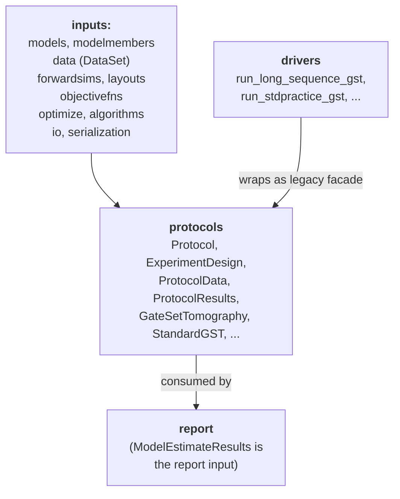

# 04 — Orchestration: protocols and drivers

**Covers:** [pygsti/protocols/](../pygsti/protocols/), [pygsti/drivers/](../pygsti/drivers/).

- [`protocols/`](../pygsti/protocols/) — the **canonical user-facing API.** `Protocol` classes orchestrate complete workflows: experiment design, data binding, iterative fitting, gauge optimization, bad-fit recovery, checkpointing, and result packaging into serializable result objects.
- [`drivers/`](../pygsti/drivers/) — thin, older-style "function-centric" entry points. They construct a Protocol internally and call `.run()`. Mostly useful to see options in what a functional API would look like relative to the object-oriented API. **Not the recommended path for new code.**

This page is the dispatcher; the details for each category live in [04-orchestration/](04-orchestration/).

## At a glance

| Category | Modules | Total Classes | Primary Classes | Secondary Classes | Sub-doc |
|---|---:|---:|---:|---:|---|
| Abstract / general infrastructure | 4 | 25 | 8 | 17 | [abstract-api.md](04-orchestration/abstract-api.md) |
| GST | 1 | 13 | 5 | 8 | [gst.md](04-orchestration/gst.md) |
| Non-GST protocols | 9 | 26 | 13 | 13 | [non-gst.md](04-orchestration/non-gst.md) |
| Legacy drivers (functions, no classes) | 2 | 0 | — | — | [drivers.md](04-orchestration/drivers.md) |
| **Total** | **16** | **64** | **26** | **38** | |

*Primary* = classes a typical user constructs by name in a workflow. *Secondary* = internal configuration helpers, runners, mixins, checkpoint classes, supporting result objects.

- **[abstract-api.md](04-orchestration/abstract-api.md)** — The general Protocol contract. `Protocol`, `ExperimentDesign`, `ProtocolData`, `ProtocolResults`, and the design-composition / runner / data-simulation machinery in [protocol.py](../pygsti/protocols/protocol.py). Also [estimate.py](../pygsti/protocols/estimate.py), [confidenceregionfactory.py](../pygsti/protocols/confidenceregionfactory.py), [treenode.py](../pygsti/protocols/treenode.py). Start here if you're writing a new Protocol subclass.

- **[gst.md](04-orchestration/gst.md)** — Gate Set Tomography orchestration: `StandardGST`, `GateSetTomography`, `StandardGSTDesign`, `GSTBadFitOptions`, `GSTGaugeOptSuite`, `ModelEstimateResults`, the iterative pipeline walkthrough, bad-fit recovery, and gauge-opt configuration.

- **[non-gst.md](04-orchestration/non-gst.md)** — The other Protocol families: RB, RPE, stability / drift, volumetric benchmarks (VB), model testing, and supporting data-simulation utilities. Each family follows the same Design → Protocol → Results triple.

- **[drivers.md](04-orchestration/drivers.md)** — The legacy function-based entry points (`run_long_sequence_gst`, `run_stdpractice_gst`, …). Don't add new ones.

## Cross-subpackage relationships

Reading arrows as **"uses"**:

`protocols/` sits at the top of the dependency stack on the "characterization" side: everything beneath it is used to build the workflow; everything above it (`report/`) consumes its output.

## Cross-cutting gotchas

- **`data` is a dangerously ambiguous variable name.** A [`ProtocolData`](../pygsti/protocols/protocol.py#L2255) and a [`DataSet`](../pygsti/data/dataset.py#L807) are *very* different objects, but both routinely get named `data` in tutorials and call sites. Always check the type — `isinstance(data, ProtocolData)` vs. `isinstance(data, DataSet)`. When you find a confusing `data` variable, consider renaming it (`pdata` for `ProtocolData`, `dataset` or `ds` for `DataSet`).

- **Gauge optimization is cross-cutting.** Reports run gauge opt before rendering metrics; Protocols run gauge opt after their fit loop. See [AGENTS.md cross-cutting](AGENTS.md#gauge-freedom-and-gauge-optimization), and [gst.md](04-orchestration/gst.md) for the `gaugeopt_suite` representation duality.

## Architectural debt

- [`gaugeopt_suite` representation duality](known-debt.md#14-gaugeopt_suite-representation-duality).
- General GST refactor threads in [#715](https://github.com/sandialabs/pyGSTi/issues/715) (subpackage restructuring).
- [#620](https://github.com/sandialabs/pyGSTi/issues/620) — parameterization-preserving gauge optimization.

## Canonical examples (orientation-level)

- [docs/markdown/overview/00-Protocols.md](../pygsti-repo/docs/markdown/overview/00-Protocols.md) — orientation-level introduction to the Protocol contract.
- [docs/markdown/overview/02-Using-Essential-Objects.md](../pygsti-repo/docs/markdown/overview/02-Using-Essential-Objects.md) — how the core objects fit together.
- [docs/markdown/gst/Overview.md](../pygsti-repo/docs/markdown/gst/Overview.md) — the canonical class-API GST tutorial. (Also linked from [gst.md](04-orchestration/gst.md).)

GST-specific examples live in [gst.md](04-orchestration/gst.md); non-GST examples (drift, RPE, mirror-circuit benchmarks, parity benchmarking, volumetric benchmarks, RB) live in [non-gst.md](04-orchestration/non-gst.md); legacy-driver tutorials live in [drivers.md](04-orchestration/drivers.md).
