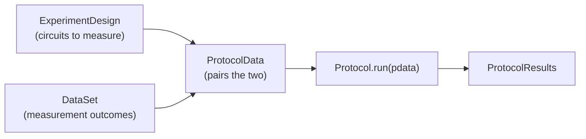

# 04 — Abstract Protocol API

**Covers:** [pygsti/protocols/protocol.py](../../pygsti/protocols/protocol.py), [estimate.py](../../pygsti/protocols/estimate.py), [confidenceregionfactory.py](../../pygsti/protocols/confidenceregionfactory.py), [treenode.py](../../pygsti/protocols/treenode.py).

The general-purpose Protocol contract that every concrete protocol — GST, RB, RPE, drift, model-test — builds on. If you're writing a new high-level workflow, the abstractions on this page are the contract you implement against.

## Mental model

### 1. The Protocol class API is canonical

The notebooks teach (and current pyGSTi recommends) the **class-based Protocol API**:

```python
edesign = pygsti.protocols.StandardGSTDesign(target_model, prep_fids, meas_fids, germs, max_lengths)
data    = pygsti.protocols.ProtocolData(edesign, dataset)
proto   = pygsti.protocols.StandardGST(modes=("CPTPLND", "Target"), gaugeopt_suite=...)
results = proto.run(data)
```

The driver functions ([`run_long_sequence_gst`](../../pygsti/drivers/longsequence.py#L315), [`run_stdpractice_gst`](../../pygsti/drivers/longsequence.py#L680)) wrap this same flow but are explicitly labeled an "older-style function-centric API" in [docs/markdown/gst/Overview-functionbased.md](../../docs/markdown/gst/Overview-functionbased.md), which recommends switching to the class-based path. See [drivers.md](drivers.md) for the wrapper layer.

If you're adding a new workflow, add a `Protocol` subclass and contain its logic in its `.run()` method.

### 2. ExperimentDesign + DataSet → ProtocolData; Protocol.run consumes it

The data-flow shape every Protocol uses:

- An [`ExperimentDesign`](../../pygsti/protocols/protocol.py#L900) describes the circuits to measure (what experiment to run).
- A [`DataSet`](../../pygsti/data/dataset.py#L807) records what came back.
- A [`ProtocolData`](../../pygsti/protocols/protocol.py#L2255) pairs them.
- A [`Protocol`](../../pygsti/protocols/protocol.py#L105) consumes the `ProtocolData` via `.run(data)` and returns a [`ProtocolResults`](../../pygsti/protocols/protocol.py#L2711).



Concrete subclasses keep the same shape: e.g. for GST, the design is [`StandardGSTDesign`](../../pygsti/protocols/gst.py#L155), the protocol is [`StandardGST`](../../pygsti/protocols/gst.py#L1739), and the result is [`ModelEstimateResults`](../../pygsti/protocols/gst.py#L2983). See [gst.md](gst.md).

### 3. Stateless kernels live in `algorithms/`

This is the single biggest confusion to new contributors. Stated explicitly:

- **[`algorithms/core.py`](../../pygsti/algorithms/core.py)** = pure functions. `run_gst_fit(mdc_store, optimizer, builder) → (opt_result, evaluated_obj_fn)`. Stateless, no checkpointing, no gauge optimization, no result packaging.
- **`protocols/`** = stateful classes. `GateSetTomography.run(data)` calls into `algorithms/core.run_gst_fit` for each iteration, then wraps the result, runs gauge optimization, handles bad-fit recovery, and writes a checkpoint to disk.

See [03-data-and-fitting.md](../03-data-and-fitting.md) for the algorithm-kernel side.

## Primary abstractions

Classes a typical user constructs or receives by name in a workflow.

| Class | File:line | Role |
|---|---|---|
| [`Protocol`](../../pygsti/protocols/protocol.py#L105) | protocol.py:105 | Abstract base; `Protocol.run(data)` sets the contract every concrete protocol implements. |
| [`ExperimentDesign`](../../pygsti/protocols/protocol.py#L900) | protocol.py:900 | Abstract base describing the circuits to measure. |
| [`ProtocolData`](../../pygsti/protocols/protocol.py#L2255) | protocol.py:2255 | Pairs an `ExperimentDesign` with a `DataSet`. Passed to `Protocol.run`. |
| [`ProtocolResults`](../../pygsti/protocols/protocol.py#L2711) | protocol.py:2711 | Result container base; what `.run()` returns. |
| [`CircuitListsDesign`](../../pygsti/protocols/protocol.py#L1496) | protocol.py:1496 | Design backed by an explicit list of `CircuitList`s. Useful for non-standard GST and many non-GST flows. |
| [`FreeformDesign`](../../pygsti/protocols/protocol.py#L2135) | protocol.py:2135 | Design over an arbitrary, user-supplied circuit set with arbitrary per-circuit metadata. |
| [`ProtocolResultsDir`](../../pygsti/protocols/protocol.py#L3065) | protocol.py:3065 | Directory-of-results container for nested / composed experiments. |
| [`Estimate`](../../pygsti/protocols/estimate.py#L37) | estimate.py:37 | A single fitted-model record — fitted `Model`(s) under various gauge-opt labels, the start model, the objective values, and metadata. Constructed by the framework; you reach into it via `results.estimates[<key>]`. See [gst.md → Reading results](gst.md#reading-results) for the typical access pattern and key names. |

## Secondary abstractions

Runners, mixins, composed designs, simulators, post-processors, and supporting result objects. The framework constructs and threads these for you; you typically don't name them in your own workflow.

| Class | File:line | Role |
|---|---|---|
| [`SlurmSettings`](../../pygsti/protocols/protocol.py#L35) | protocol.py:35 | SLURM batch-script settings container. |
| [`MultiPassProtocol`](../../pygsti/protocols/protocol.py#L573) | protocol.py:573 | Wraps a Protocol to run over a `MultiDataSet`. |
| [`ProtocolRunner`](../../pygsti/protocols/protocol.py#L647) | protocol.py:647 | Base class for running a protocol against a data tree. |
| [`TreeRunner`](../../pygsti/protocols/protocol.py#L682) | protocol.py:682 | Runner for tree-structured nested experiments. |
| [`SimpleRunner`](../../pygsti/protocols/protocol.py#L743) | protocol.py:743 | Runner for leaf-node protocol runs. |
| [`DefaultRunner`](../../pygsti/protocols/protocol.py#L827) | protocol.py:827 | Runner using default protocols. |
| [`CanCreateAllCircuitsDesign`](../../pygsti/protocols/protocol.py#L1400) | protocol.py:1400 | Mixin: design exposes a generator over all of its circuits. |
| [`CombinedExperimentDesign`](../../pygsti/protocols/protocol.py#L1703) | protocol.py:1703 | Composes multiple sub-designs. |
| [`SimultaneousExperimentDesign`](../../pygsti/protocols/protocol.py#L1934) | protocol.py:1934 | Composes designs whose circuits are tensored together. |
| [`MultiPassResults`](../../pygsti/protocols/protocol.py#L2951) | protocol.py:2951 | Results container for `MultiPassProtocol`. |
| [`ProtocolPostProcessor`](../../pygsti/protocols/protocol.py#L3469) | protocol.py:3469 | Post-analysis hook over existing results. |
| [`DataSimulator`](../../pygsti/protocols/protocol.py#L3568) | protocol.py:3568 | Abstract base for simulation-based data generation. |
| [`DataCountsSimulator`](../../pygsti/protocols/protocol.py#L3608) | protocol.py:3608 | `DataSimulator` for outcome-count generation. |
| [`ProtocolCheckpoint`](../../pygsti/protocols/protocol.py#L3720) | protocol.py:3720 | Base class for on-disk checkpoint state. |
| [`ConfidenceRegionFactory`](../../pygsti/protocols/confidenceregionfactory.py#L59) | confidenceregionfactory.py:59 | Lazy computation of confidence intervals from the fit Hessian. |
| [`ConfidenceRegionFactoryView`](../../pygsti/protocols/confidenceregionfactory.py#L786) | confidenceregionfactory.py:786 | Lightweight view of a `ConfidenceRegionFactory`. |
| [`TreeNode`](../../pygsti/protocols/treenode.py#L20) | treenode.py:20 | Base class for filesystem-directory-backed objects. |

## Pitfalls and gotchas

- See the dispatcher's [Cross-cutting gotchas](../04-orchestration.md#cross-cutting-gotchas) for the `data` (`ProtocolData`) vs. `DataSet` ambiguity and the gauge-optimization cross-cutting note — both apply at the abstract layer.

## Canonical examples

- [docs/markdown/overview/00-Protocols.md](../../docs/markdown/overview/00-Protocols.md) — orientation-level introduction to the Protocol contract.
- [docs/markdown/overview/02-Using-Essential-Objects.md](../../docs/markdown/overview/02-Using-Essential-Objects.md) — how `ExperimentDesign`, `ProtocolData`, `Protocol`, and `ProtocolResults` fit together.
