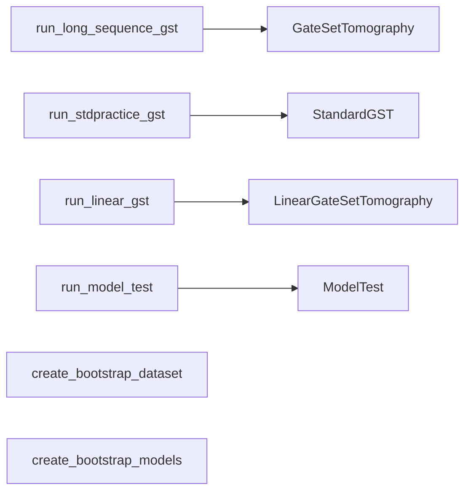

# 04 — Legacy drivers

**Covers:** [pygsti/drivers/longsequence.py](../../pygsti/drivers/longsequence.py), [pygsti/drivers/bootstrap.py](../../pygsti/drivers/bootstrap.py).

Thin, older-style "function-centric" entry points. Each driver constructs a Protocol internally and calls `.run()`. **Not the recommended path for new code** — the class-based API in [abstract-api.md](abstract-api.md) is canonical.

If you're maintaining or porting an old call site, this is the right page. If you're writing new orchestration, write a `Protocol` subclass instead (see [abstract-api.md](abstract-api.md) and [gst.md](gst.md)).

## Mental model

### Drivers are thin wrappers around Protocol classes

The bootstrap helpers (`create_bootstrap_dataset`, `create_bootstrap_models`) are standalone — they don't wrap a Protocol class; they're resampling utilities.

## Functions

| Function | File:line | Role |
|---|---|---|
| [`run_long_sequence_gst`](../../pygsti/drivers/longsequence.py#L315) | longsequence.py:315 | Classic single-mode GST driver. Wraps [`GateSetTomography`](../../pygsti/protocols/gst.py#L1244). |
| [`run_stdpractice_gst`](../../pygsti/drivers/longsequence.py#L680) | longsequence.py:680 | Multi-mode GST driver. Wraps [`StandardGST`](../../pygsti/protocols/gst.py#L1739). |
| [`run_linear_gst`](../../pygsti/drivers/longsequence.py#L204) | longsequence.py:204 | LGST driver. Wraps [`LinearGateSetTomography`](../../pygsti/protocols/gst.py#L1561). |
| [`run_model_test`](../../pygsti/drivers/longsequence.py#L34) | longsequence.py:34 | Model-testing driver. Wraps [`ModelTest`](../../pygsti/protocols/modeltest.py#L30). |
| [`create_bootstrap_dataset`](../../pygsti/drivers/bootstrap.py#L20) | bootstrap.py:20 | Bootstrap-resample a `DataSet`. |
| [`create_bootstrap_models`](../../pygsti/drivers/bootstrap.py#L109) | bootstrap.py:109 | Bootstrap-fit models against resampled datasets. |

## Pitfalls and gotchas

- **Driver functions are legacy.** Don't add new ones. If a tutorial calls `run_long_sequence_gst`, that's a reasonable migration target — port to `StandardGST(...).run(data)` (or `GateSetTomography(...).run(data)`) when you next touch the call site.
- **The function-centric tutorial labels itself "older-style."** [docs/markdown/gst/Overview-functionbased.md](../../docs/markdown/gst/Overview-functionbased.md) explicitly recommends switching to the class-based path.

## Canonical examples

- [docs/markdown/gst/Overview-functionbased.md](../../docs/markdown/gst/Overview-functionbased.md) — the legacy function-based tutorial. Useful when porting old code.
- [docs/markdown/gst/Driverfunctions.md](../../docs/markdown/gst/Driverfunctions.md) — driver functions in detail.
