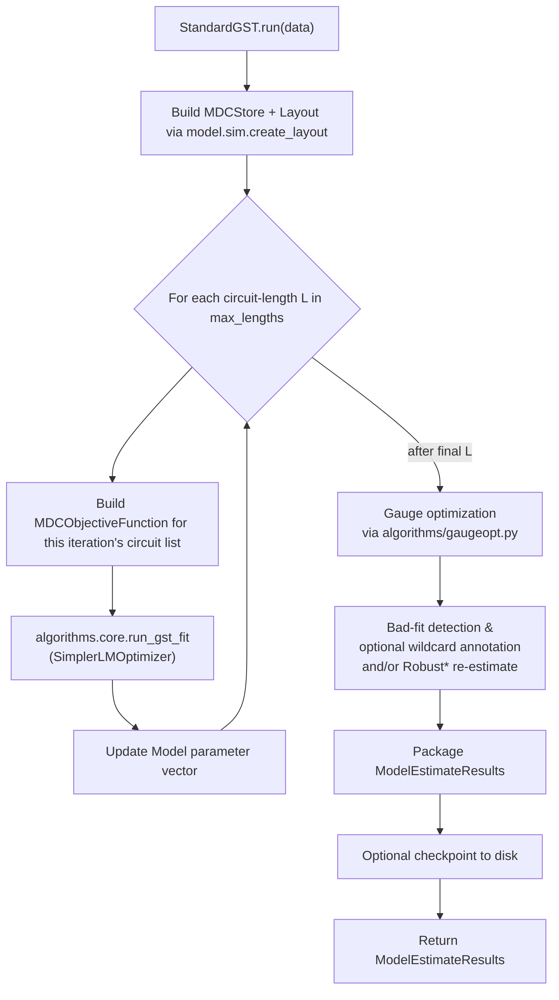
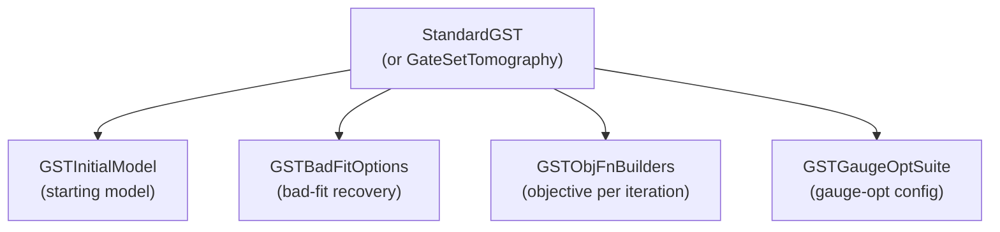

# 04 — GST orchestration

**Covers:** [pygsti/protocols/gst.py](../../pygsti/protocols/gst.py).

The Protocol classes and configuration objects that drive Gate Set Tomography. If you're running GST, debugging a fit, configuring gauge-opt, or extending GST itself, this is the right page.

For the general Protocol contract that GST builds on, see [abstract-api.md](abstract-api.md). For the stateless fitting kernels GST calls into, see [03-data-and-fitting.md](../03-data-and-fitting.md).

## Mental model

### 1. `StandardGST` is a multi-mode wrapper over `GateSetTomography`

[`StandardGST`](../../pygsti/protocols/gst.py#L1739)`(modes=("CPTPLND", "Target", ...))` runs [`GateSetTomography`](../../pygsti/protocols/gst.py#L1244) internally for each mode, accumulates each result as an [`Estimate`](../../pygsti/protocols/estimate.py#L37), and packages them into a single [`ModelEstimateResults`](../../pygsti/protocols/gst.py#L2983) keyed by mode name. Use `GateSetTomography` directly when you want a single starting model with no enclosing mode dispatch. [`LinearGateSetTomography`](../../pygsti/protocols/gst.py#L1561) is a separate, LGST-only protocol — it does not share the iterative-fit loop.

### 2. The fit is iterative over a growing circuit list

`StandardGSTDesign` exposes circuit lists indexed by `max_lengths = [L_1 < L_2 < ... < L_max]`. The protocol runs one optimizer pass per max-length, warm-starting from the previous iteration's parameter vector and using the same `MDCStore` + `Layout` throughout. The objective function changes each iteration because the circuit list grows; the optimizer and model don't.

### 3. Bad-fit recovery and gauge optimization are post-fit steps

Both are configured up-front by passing config objects to the Protocol, then triggered after the iterative fit completes:

- [`GSTGaugeOptSuite`](../../pygsti/protocols/gst.py#L857) (or the older `list[list[dict]]` form) — always runs.
- [`GSTBadFitOptions`](../../pygsti/protocols/gst.py#L594) — runs only when `misfit_sigma > threshold`.

The pipeline walkthrough below shows where these fire in the call order.

## Pipeline walkthrough

What happens when a user calls `StandardGST(...).run(data)`:



Key things to notice:

- The same Layout is reused across iterations (constructed once at the top).
- The optimizer is _usually_ the same `SimplerLMOptimizer` each iteration, with only the objective function changing between iterations. It's possible to set different optimizers for each iteration.
- Gauge optimization happens *after* the fit loop completes, not per iteration.
- Bad-fit handling triggers only when `misfit_sigma > GSTBadFitOptions.threshold`, and it takes one of two shapes — see the gotcha for the full taxonomy.

## Primary abstractions

Classes a typical user constructs or receives by name when running GST.

| Class | File:line | Role |
|---|---|---|
| [`GateSetTomographyDesign`](../../pygsti/protocols/gst.py#L91) | gst.py:91 | Minimal GST experiment design — a lightweight concrete wrapper over [`CircuitListsDesign`](../../pygsti/protocols/protocol.py#L1496) plus the [`HasProcessorSpec`](../../pygsti/protocols/gst.py#L66) mixin. Use directly when you want a GST-flavored design without the germ/fiducial/max-length structure of `StandardGSTDesign`. |
| [`StandardGSTDesign`](../../pygsti/protocols/gst.py#L155) | gst.py:155 | The canonical GST design — germ-power circuits, fiducials, optional fiducial-pair reduction. |
| [`StandardGST`](../../pygsti/protocols/gst.py#L1739) | gst.py:1739 | Runs `GateSetTomography` across multiple starting-model modes (CPTPLND, Target, etc.). The recommended user-facing entry point ***IF*** they don't have a special model parameterization. |
| [`GateSetTomography`](../../pygsti/protocols/gst.py#L1244) | gst.py:1244 | The single-mode iterative GST protocol. Use directly when you don't need multi-mode dispatch, or when you have a special model parameterization. This is of increasing importance as we consider reduced-order models for multi-qubit systems. |
| [`ModelEstimateResults`](../../pygsti/protocols/gst.py#L2983) | gst.py:2983 | Container of one-or-more `Estimate` objects + circuit lists. What `.run()` returns. |

### How the configuration objects plug into `StandardGST`



`StandardGST` is the explicit user touchpoint; the four config objects (`GSTInitialModel`, `GSTBadFitOptions`, `GSTObjFnBuilders`, `GSTGaugeOptSuite`) all plug in here but are typically left at defaults — most users pass primitive values (a suite name, a threshold dict, etc.) and let `cast(...)` build the config object internally.

## Reading results

`.run()` returns a [`ModelEstimateResults`](../../pygsti/protocols/gst.py#L2983) — a container of one-or-more [`Estimate`](../../pygsti/protocols/estimate.py#L37) objects. The common access pattern is two dict lookups deep:

```python
mer = standard_gst.run(data)                    # ModelEstimateResults
est = mer.estimates['CPTPLND']                  # Estimate (key = mode name; see below)
mdl = est.models['stdgaugeopt']                 # the gauge-optimized fitted Model
```

### Typical keys in `mer.estimates`

The first dict is keyed by **starting-model / parameterization label**:

- For [`StandardGST`](../../pygsti/protocols/gst.py#L1739), the keys are the strings you passed as `modes=...`. The default is `('full TP', 'CPTPLND', 'Target')`. Inside [`StandardGST.run`](../../pygsti/protocols/gst.py#L1956), each mode is dispatched three ways:

  - `'Target'` is special-cased to run a [`ModelTest`](../../pygsti/protocols/modeltest.py#L30) against the (unparameterized) target model — no GST fit.
  - Any mode present in the `models_to_test` dict (an optional `StandardGST` argument) is also model-tested, against the user-supplied Model.
  - Other `mode` strings are interpreted as a **parameterization name**. The code copies the target model and calls [`Model.set_all_parameterizations(mode)`](../../pygsti/models/explicitmodel.py#L449) then runs `GateSetTomography` on that model.

- For a single-mode [`GateSetTomography`](../../pygsti/protocols/gst.py#L1244) run, the key is the protocol's `name` attribute. This defaults to the class name ("`GateSetTomography`") if not set.
- When bad-fit recovery fires (see the gotcha), additional keys appear alongside the primary one, suffixed with the action name — e.g. `'CPTPLND.Robust+'` for the re-optimized robust estimate or `'CPTPLND.wildcard'` for a wildcard-annotated variant. The primary `'CPTPLND'` entry is preserved.

### Typical keys in `Estimate.models`

- `'final iteration estimate'` — the raw fit at the final max-length iteration, **before** any gauge optimization. This is the seed for every gauge-opt entry below.
- `'stdgaugeopt'` — the default gauge-optimization result (the one most users want). Produced when `gaugeopt_suite='stdgaugeopt'`, which is the default.
- Any additional suite labels you configured via [`GSTGaugeOptSuite`](../../pygsti/protocols/gst.py#L857). The built-in suite names are listed in [`GSTGaugeOptSuite.STANDARD_SUITENAMES`](../../pygsti/protocols/gst.py#L896).
- When LGST is run as a seed for iterative GST, you may also see `'lgst_gaugeopt'` and `'trivial_gauge_opt'`.

### Other accessors on `Estimate`

- `est.parameters` — fit metadata (objective value, chi-squared, misfit sigma, optimizer info, …).
- `est.extra_parameters` — bad-fit recovery artifacts (e.g. `'unmodeled_error'` for wildcard runs).
- `est.confidence_region_factories[(model_key, circuit_list_label)]` — lazy [`ConfidenceRegionFactory`](../../pygsti/protocols/confidenceregionfactory.py#L59) objects for confidence intervals.

## Secondary abstractions

Configuration helpers, mixins, the LGST protocol, and checkpoints. Most are constructed or threaded by the framework — you encounter them through `StandardGST`'s constructor or by inspecting checkpoint files.

| Class | File:line | Role |
|---|---|---|
| [`HasProcessorSpec`](../../pygsti/protocols/gst.py#L66) | gst.py:66 | Mixin adding a `processor_spec` attribute to designs. |
| [`LinearGateSetTomography`](../../pygsti/protocols/gst.py#L1561) | gst.py:1561 | LGST-only protocol (no iterative refinement). Niche compared to `StandardGST` / `GateSetTomography`. |
| [`GSTBadFitOptions`](../../pygsti/protocols/gst.py#L594) | gst.py:594 | Bad-fit detection and recovery (wildcard or robust family). Users rarely set this explicitly. See gotchas. |
| [`GSTGaugeOptSuite`](../../pygsti/protocols/gst.py#L857) | gst.py:857 | Gauge-optimization suite configuration. Most users pass a suite name (e.g. `'stdgaugeopt'`) or a `list[list[dict]]` rather than constructing this directly. See gotchas. |
| [`GSTInitialModel`](../../pygsti/protocols/gst.py#L401) | gst.py:401 | Configures the starting model for a GST fit (target / LGST / depolarized / …). Usually default. |
| [`GSTObjFnBuilders`](../../pygsti/protocols/gst.py#L748) | gst.py:748 | Per-iteration objective-function builders. Usually default. |
| [`GateSetTomographyCheckpoint`](../../pygsti/protocols/gst.py#L3406) | gst.py:3406 | On-disk checkpoint for a `GateSetTomography` run. Written automatically. |
| [`StandardGSTCheckpoint`](../../pygsti/protocols/gst.py#L3471) | gst.py:3471 | On-disk checkpoint for a `StandardGST` run. Written automatically. |

## Pitfalls and gotchas

- **`GSTBadFitOptions` actions split into two mechanism families, and they do *different* things.** The trigger for both is the same: `misfit_sigma > threshold`. From there:

  - **Wildcard family** (`'wildcard'`, `'wildcard1d'`): the primary estimate's Model is *not* changed. Instead, a [`WildcardBudget`](../../pygsti/objectivefns/wildcardbudget.py) is fit on top of the existing Model, allocating per-primitive-op slack to the predicted probabilities until the model+slack admits the data. The result is recorded on the primary estimate as `Estimate.extra_parameters['unmodeled_error']` and surfaced by reports as an unmodeled-error / "this is how much the model couldn't account for" budget. This is *not* robustness in the sense of robust optimization; it is "say something useful in the face of a misspecified fit." See [03-data-and-fitting.md](../03-data-and-fitting.md) for the budget-class details. The `'wildcard1d'` variant uses a single scalar parameter scaling a reference weighting (typically diamond distance) and is the form that produces unambiguous numbers; the multi-parameter `'wildcard'` form has known non-uniqueness (parameters can "slosh" — see [docs/markdown/gst/Protocols.md](../../pygsti-repo/docs/markdown/gst/Protocols.md)).
  - **Robust family** (`'robust'`, `'Robust'`, `'robust+'`, `'Robust+'`): scale down outlier circuit data based on a chi-squared confidence threshold. The lowercase variants only rescale (and add a `.<action>` estimate with the rescaled data). The capitalized variants additionally **re-optimize** the final-stage objective on the rescaled data, producing a re-fitted Model that lands in `.<action>` alongside the primary. This is closer to classical "robust statistics" — outlier-resistant estimation.

  Both families add metadata to `Estimate.extra_parameters`. The actual prominence of either in typical workflows is uncertain — flag them when describing the result-object shape but don't over-elevate.

- **`gaugeopt_suite` has two representations.** A gauge-optimization suite is variously a `list[list[dict]]` (the older shape) or a [`GSTGaugeOptSuite`](../../pygsti/protocols/gst.py#L857) object (the newer shape). Different entry points accept different shapes; some accept both. When configuring a non-trivial gauge-opt setup, check what shape the entry point you're calling expects. Tracked in [known-debt.md #14](../known-debt.md#14-gaugeopt_suite-representation-duality). Concrete example of both shapes:

  ```python
  # list-of-list-of-dicts shape:
  gaugeopt_suite = [
      [{"item_weights": {"gates": 1.0, "spam": 0.001}}],
      [{"item_weights": {"gates": 1.0, "spam": 1.0}}],
  ]

  # GSTGaugeOptSuite shape:
  gaugeopt_suite = pygsti.protocols.GSTGaugeOptSuite(gaugeopt_suite_names=("stdgaugeopt",))
  ```

- **Checkpointing has subtleties.** `GateSetTomography` and `StandardGST` write checkpoints during long fits. Resuming a fit reads the checkpoint, but if the surrounding code (Model, ExperimentDesign, etc.) has changed in ways that affect parameter layout, the resume can produce inconsistent results. Treat checkpoints as fit-specific and don't reuse them across code changes.

## Architectural debt

- [`gaugeopt_suite` representation duality](../known-debt.md#14-gaugeopt_suite-representation-duality).
- [#620](https://github.com/sandialabs/pyGSTi/issues/620) — parameterization-preserving gauge optimization.
- General GST refactor threads in [#715](https://github.com/sandialabs/pyGSTi/issues/715) (subpackage restructuring).

## Canonical examples

- [docs/markdown/gst/Overview.md](../../pygsti-repo/docs/markdown/gst/Overview.md) — **the canonical class-API GST tutorial.** Read this first.
- [docs/markdown/gst/Protocols.md](../../pygsti-repo/docs/markdown/gst/Protocols.md) — Protocol class details for GST.
- [docs/markdown/gst/Overview-functionbased.md](../../pygsti-repo/docs/markdown/gst/Overview-functionbased.md) — the legacy function-based path, useful when porting old code. See [drivers.md](drivers.md).
- [docs/markdown/gst/Driverfunctions.md](../../pygsti-repo/docs/markdown/gst/Driverfunctions.md) — driver functions in detail.
- [docs/markdown/examples/MPI-RunningGST.md](../../pygsti-repo/docs/markdown/examples/MPI-RunningGST.md) — class-API usage under MPI.
