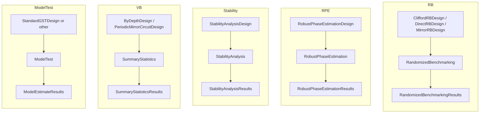

# 04 — Non-GST protocols

**Covers:** [pygsti/protocols/rb.py](../../pygsti/protocols/rb.py), [rpe.py](../../pygsti/protocols/rpe.py), [stability.py](../../pygsti/protocols/stability.py), [vb.py](../../pygsti/protocols/vb.py), [vbdataframe.py](../../pygsti/protocols/vbdataframe.py), [modeltest.py](../../pygsti/protocols/modeltest.py), [freeformsim.py](../../pygsti/protocols/freeformsim.py), [mirror_edesign.py](../../pygsti/protocols/mirror_edesign.py) (functions only), [scarab.py](../../pygsti/protocols/scarab.py) (functions only), [su2rb.py](../../pygsti/protocols/su2rb.py).

The non-GST Protocol families: randomized benchmarking (RB), robust phase estimation (RPE), stability/drift, volumetric benchmarks (VB), model testing, and supporting data-simulation utilities. They share the abstract Protocol contract described in [abstract-api.md](abstract-api.md); this page records what each family's concrete `Design → Protocol → Results` triple looks like.

For idle tomography and other characterization protocols housed under `extras/` rather than `protocols/`, see [08-domain-plugins.md](../08-domain-plugins.md).

## Mental model

### Every non-GST family is a Design → Protocol → Results triple

The abstract data-flow (`ExperimentDesign → ProtocolData → Protocol.run → ProtocolResults`) repeats once per family with different concrete classes:

A few practical notes:

- **RB has multiple design variants** (Clifford / Direct / Mirror) and a separate interleaved-RB protocol pair. They all feed the same `RandomizedBenchmarking` analysis.
- **`ModelTest` returns `ModelEstimateResults`** — the same result type GST uses — because it produces an estimate-shaped object (the model under test gets wrapped as an `Estimate`).
- **VB (`SummaryStatistics`)** is the protocol used by volumetric / mirror-circuit / parity benchmarks. The depth-organized variant is `ByDepthSummaryStatistics`.
- **`freeformsim.py`** is a data-simulation utility used to generate synthetic outcome counts from a `Model` or an arbitrary state function — useful when you want to drive a non-GST protocol against simulated data instead of hardware.
- **`su2rb.py`** is a self-contained `Design → DataSimulator → Protocol → Results` family implementing the rank-1 (Legendre-weighted) synthetic-SPAM randomized benchmarking protocol (R1RB) of "Randomized Benchmarking with Synthetic Quantum Circuits" for an arbitrary-spin SU(2)/qudit system. It does not reuse `vb.py`'s `SummaryStatistics`/fitting machinery beyond subclassing `BenchmarkingDesign` for its design; probabilities are simulated directly against `pygsti.tools.su2tools.SpinJ` representations rather than through a full pyGSTi `Model`. It depends on two `pygsti.tools` modules: `wignersymbols.py` (exact Clebsch-Gordan/Wigner 6-j) and `su2tools.py` (the `SpinJ` representation class). `SU2QuditRBSimulator`'s `noise_channel` accepts a fixed superoperator applied after every gate, or a callable factory `(alpha, beta, gamma) -> superoperator` invoked per gate with that gate's own Euler angles, for gate-dependent noise.

## Primary abstractions

Classes a typical user constructs by name when running a non-GST protocol.

| Class | File:line | Role |
|---|---|---|
| [`CliffordRBDesign`](../../pygsti/protocols/rb.py#L24) | rb.py:24 | Clifford randomized-benchmarking experiment design. |
| [`DirectRBDesign`](../../pygsti/protocols/rb.py#L388) | rb.py:388 | Direct-RB design (native-gate sequences). |
| [`MirrorRBDesign`](../../pygsti/protocols/rb.py#L734) | rb.py:734 | Mirror-RB design (forward + inverse sandwich). |
| [`RandomizedBenchmarking`](../../pygsti/protocols/rb.py#L1335) | rb.py:1335 | Protocol that fits exponential decay to RB survival probabilities. |
| [`InterleavedRandomizedBenchmarking`](../../pygsti/protocols/rb.py#L1685) | rb.py:1685 | Interleaved-RB protocol (gate-specific RB number). |
| [`RobustPhaseEstimationDesign`](../../pygsti/protocols/rpe.py#L22) | rpe.py:22 | RPE experiment design. |
| [`RobustPhaseEstimation`](../../pygsti/protocols/rpe.py#L166) | rpe.py:166 | RPE protocol. |
| [`StabilityAnalysisDesign`](../../pygsti/protocols/stability.py#L16) | stability.py:16 | Drift / stability experiment design. |
| [`StabilityAnalysis`](../../pygsti/protocols/stability.py#L36) | stability.py:36 | Stability-analysis protocol. |
| [`ByDepthDesign`](../../pygsti/protocols/vb.py#L22) | vb.py:22 | Generic depth-organized design — base for VB / mirror-circuit / parity benchmarks. |
| [`PeriodicMirrorCircuitDesign`](../../pygsti/protocols/vb.py#L328) | vb.py:328 | Periodic mirror-circuit VB design. |
| [`SummaryStatistics`](../../pygsti/protocols/vb.py#L544) | vb.py:544 | VB-family protocol that computes summary statistics over an experiment. |
| [`ModelTest`](../../pygsti/protocols/modeltest.py#L30) | modeltest.py:30 | Tests a Model against data without fitting. |
| [`SU2QuditRBDesign`](../../pygsti/protocols/su2rb.py#L84) | su2rb.py:84 | Synthetic-SPAM RB design for an arbitrary-spin SU(2)/qudit system; always uses the hidden-first-gate convention. |
| [`SU2QuditRBSimulator`](../../pygsti/protocols/su2rb.py#L297) | su2rb.py:297 | `DataSimulator` that simulates SU(2) RB circuits directly against a `SpinJ` representation (no full `Model`); `noise_channel` may be a fixed superoperator or a per-gate callable factory. |
| [`SU2QuditRB`](../../pygsti/protocols/su2rb.py#L722) | su2rb.py:722 | Protocol implementing the rank-1 (Legendre-weighted) synthetic-SPAM RB (R1RB): per-irrep decay fits and rate recovery. |

## Secondary abstractions

Niche design variants, framework-constructed result containers, intermediate abstract bases, checkpoint classes, and supporting utilities.

| Class | File:line | Role |
|---|---|---|
| [`BinaryRBDesign`](../../pygsti/protocols/rb.py#L1024) | rb.py:1024 | Binary RB variant. |
| [`InterleavedRBDesign`](../../pygsti/protocols/rb.py#L1158) | rb.py:1158 | Composed design pairing reference and interleaved sub-designs. |
| [`RandomizedBenchmarkingResults`](../../pygsti/protocols/rb.py#L1536) | rb.py:1536 | RB result container. |
| [`InterleavedRandomizedBenchmarkingResults`](../../pygsti/protocols/rb.py#L1807) | rb.py:1807 | Interleaved-RB result container. |
| [`RobustPhaseEstimationResults`](../../pygsti/protocols/rpe.py#L265) | rpe.py:265 | RPE result container. |
| [`StabilityAnalysisResults`](../../pygsti/protocols/stability.py#L457) | stability.py:457 | Stability-analysis result container. |
| [`BenchmarkingDesign`](../../pygsti/protocols/vb.py#L122) | vb.py:122 | Intermediate base for benchmarking-style designs. |
| [`ByDepthSummaryStatistics`](../../pygsti/protocols/vb.py#L959) | vb.py:959 | Depth-organized summary-statistics protocol. |
| [`SummaryStatisticsResults`](../../pygsti/protocols/vb.py#L1088) | vb.py:1088 | VB-family result container. |
| [`ModelTestCheckpoint`](../../pygsti/protocols/modeltest.py#L297) | modeltest.py:297 | `ModelTest` checkpoint state. |
| [`VBDataFrame`](../../pygsti/protocols/vbdataframe.py#L161) | vbdataframe.py:161 | DataFrame container for VB data with plotting helpers. |
| [`FreeformDataSimulator`](../../pygsti/protocols/freeformsim.py#L21) | freeformsim.py:21 | `DataSimulator` for arbitrary state functions. |
| [`ModelFreeformSimulator`](../../pygsti/protocols/freeformsim.py#L93) | freeformsim.py:93 | `FreeformDataSimulator` driven by a `Model`. |
| [`SU2QuditRBResults`](../../pygsti/protocols/su2rb.py#L909) | su2rb.py:909 | Results container for `SU2QuditRB` (`rates_dataframe()`, `variance_diagnostic()`). |

[`mirror_edesign.py`](../../pygsti/protocols/mirror_edesign.py) and [`scarab.py`](../../pygsti/protocols/scarab.py) contain helper functions only — no top-level classes. `mirror_edesign.py` provides converters (e.g., from Qiskit circuits into mirror-circuit experiment designs); `scarab.py` provides SCARAB benchmarking helpers.

## Pitfalls and gotchas

- **`ModelTest` returns a `ModelEstimateResults`, not a bespoke results type.** When inspecting results from a `ModelTest` run, expect the same container that GST produces — the model under test lives as an `Estimate` inside it.

## Canonical examples

- [docs/markdown/protocols/](../../docs/markdown/protocols/) — notebooks for several non-GST protocols: drift characterization, RPE, mirror-circuit benchmarks, parity benchmarking, volumetric benchmarks, interpolated operators.
- [docs/markdown/protocols/DriftCharacterization.md](../../docs/markdown/protocols/DriftCharacterization.md), [RobustPhaseEstimation.md](../../docs/markdown/protocols/RobustPhaseEstimation.md).
- [docs/markdown/rb/](../../docs/markdown/rb/) — RB tutorials (the RB Protocol lives in `protocols/rb.py`; supporting analysis can pull from `extras/` and `tools/rbtheory.py`).
- **Skip [docs/markdown/protocols/IdleTomography.md](../../docs/markdown/protocols/IdleTomography.md)** — the underlying subsystem under `extras/idletomography/` is broken. See [08-domain-plugins.md](../08-domain-plugins.md).
