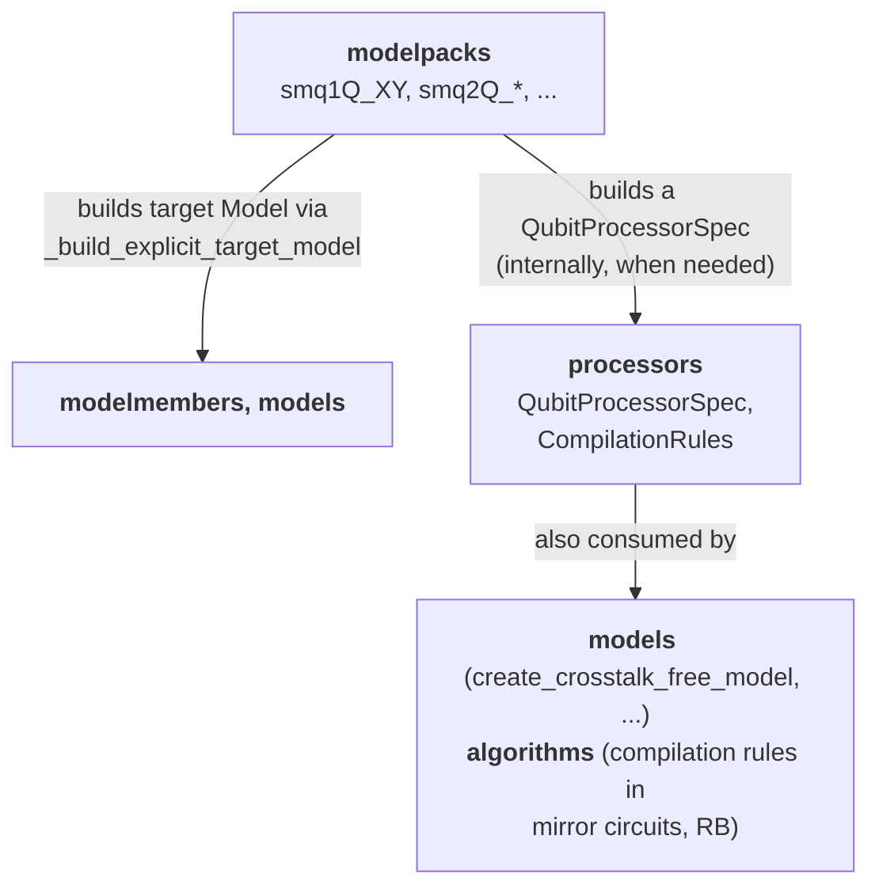

# 06 — Modelpacks and processors

**Covers:** [pygsti/modelpacks/](../pygsti/modelpacks/), [pygsti/processors/](../pygsti/processors/).

## What lives here

- [`processors/`](../pygsti/processors/) — **device descriptions**. What gates a hardware target supports, the qudit graph (connectivity), Clifford compilation rules, random-compilation helpers. The central object is `QubitProcessorSpec` / `QuditProcessorSpec`.
- [`modelpacks/`](../pygsti/modelpacks/) — **named, preconfigured Models** for canonical gate sets (`smq1Q_XY`, `smq2Q_XYCNOT`, …). Each modelpack ships the target Model **plus precomputed GST building blocks**: germs, prep and measurement fiducials, Clifford compilations, and global / per-germ fiducial-pair reductions (FPR). Loading a modelpack gives you everything you need to spin up a GST experiment design.

Most of `modelpacks/` is data. The infrastructure is small.

## Mental model

### 1. Modelpack definitions are metaprogrammed via `sys.modules` substitution

This is the single most surprising thing about `modelpacks/`. Open [pygsti/modelpacks/smq1Q_XY.py](../pygsti/modelpacks/smq1Q_XY.py) and scroll to the bottom:

```python
class _Module(GSTModelPack, RBModelPack):
    description = "X(pi/2) and Y(pi/2) gates"
    gates = [('Gxpi2', 0), ('Gypi2', 0)]
    # ... ~80 lines of germs, fiducials, fidpair reductions, clifford compilation ...
    def _target_model(self, sslbls, **kwargs):
        return self._build_explicit_target_model(
            sslbls, [('Gxpi2', 0), ('Gypi2', 0)], ['X(pi/2,{0})', 'Y(pi/2,{0})'], **kwargs)

import sys
sys.modules[__name__] = _Module()
```

The last two lines **replace the module in `sys.modules` with an instance of `_Module`**. So `import pygsti.modelpacks.smq1Q_XY` does not give you a module — it gives you an *instance* of `_Module`. The dot-syntax then accesses instance attributes and methods directly. `pygsti.modelpacks.smq1Q_XY.target_model()` works as if `target_model` were a module-level function because, at that point, `pygsti.modelpacks.smq1Q_XY` is the instance.

**Don't treat modelpack files like ordinary modules.** Specifically:

- Static-analysis tools (IDE "go to definition", `pyright`, `mypy`) **will not** trace `smq1Q_XY.target_model` to its definition. The actual API lives on the base classes in [pygsti/modelpacks/_modelpack.py](../pygsti/modelpacks/_modelpack.py).
- Inside a modelpack file, any module-level names you'd normally add (helper functions, constants) become attributes of `_Module` only if they're class attributes.

### 2. `GSTModelPack` is where the user-facing API lives

Notebooks never refer to `GSTModelPack` directly. They `import` a concrete `smq*` modelpack and call methods on it:

```python
from pygsti.modelpacks import smq1Q_XY
target_model   = smq1Q_XY.target_model()      # a Model object
prep_fiducials = smq1Q_XY.prep_fiducials()    # a list of Circuit objects
meas_fiducials = smq1Q_XY.meas_fiducials()    # a list of Circuit objects
germs          = smq1Q_XY.germs()             # a list of Circuit objects
# ... and frequently the one-call convenience:
exp_design     = smq1Q_XY.create_gst_experiment_design(max_max_length=32)
```

Each `smq*` import is an *instance* of a [`GSTModelPack`](../pygsti/modelpacks/_modelpack.py#L149) subclass (and sometimes additionally [`RBModelPack`](../pygsti/modelpacks/_modelpack.py#L491)) — see Mental Model 1 above for the `sys.modules` substitution trick that makes that work. The methods in the snippet are defined on the base classes in [`_modelpack.py`](../pygsti/modelpacks/_modelpack.py).

Three base classes in [`_modelpack.py`](../pygsti/modelpacks/_modelpack.py):

- [`ModelPack`](../pygsti/modelpacks/_modelpack.py#L34) — minimal ABC. Defines `target_model(...)` (with the `_gscache` parameterization cache) and `processor_spec(...)`. Subclasses must implement `_target_model(sslbls, **kwargs)`.
- [`GSTModelPack(ModelPack)`](../pygsti/modelpacks/_modelpack.py#L149) — adds the GST-specific accessors (germs, fiducials, FPR) and the `create_gst_experiment_design` convenience. **This is the class that supplies the API every `smq*` notebook uses.**
- [`RBModelPack(ModelPack)`](../pygsti/modelpacks/_modelpack.py#L491) — adds [`clifford_compilation(qubit_labels=None)`](../pygsti/modelpacks/_modelpack.py#L504) for RB workflows.

A concrete `smq*` pack subclasses one or both (most subclass `GSTModelPack`; a handful also subclass `RBModelPack`) and supplies class-attribute *data*: `_germs`, `_germs_lite`, `_prepfiducials`, `_measfiducials` (or `_fiducials` when the two coincide), `_pergerm_fidpairsdict`, `_pergerm_fidpairsdict_lite`, `global_fidpairs`, `global_fidpairs_lite`, `_clifford_compilation`, plus the `gates` list and `description` string. Plus a `_target_model(sslbls, **kwargs)` method that constructs the target Model from gate expressions (typically by delegating to `self._build_explicit_target_model(...)`).

#### The methods you'll actually call

On any `GSTModelPack` instance — i.e., any GST-flavored `smq*` pack:

- [`target_model(gate_type='full', prep_type='auto', povm_type='auto', instrument_type='auto', simulator='auto', evotype='default', qubit_labels=None)`](../pygsti/modelpacks/_modelpack.py#L71) — returns a *copy* of the target Model in the requested parameterization. Cached per parameter-tuple in `_gscache`, so repeated identical calls are cheap.
- [`prep_fiducials(qubit_labels=None)`](../pygsti/modelpacks/_modelpack.py#L258), [`meas_fiducials(qubit_labels=None)`](../pygsti/modelpacks/_modelpack.py#L274) — the SPAM fiducial circuits.
- [`fiducials(qubit_labels=None)`](../pygsti/modelpacks/_modelpack.py#L242) — the single shared fiducial list, for packs where prep and meas fiducials coincide.
- [`germs(qubit_labels=None, lite=True)`](../pygsti/modelpacks/_modelpack.py#L215) — germ circuits. `lite=True` (the default) returns the shorter set that amplifies first-order errors only; `lite=False` returns the larger set that amplifies arbitrary small deviations. Almost all tutorials use the default. There is no separate `germs_lite()` method — pass `lite=...` to `germs(...)`.
- [`pergerm_fidpair_dict(qubit_labels=None)`](../pygsti/modelpacks/_modelpack.py#L290) and [`pergerm_fidpair_dict_lite(qubit_labels=None)`](../pygsti/modelpacks/_modelpack.py#L308) — per-germ fiducial-pair reductions (the most aggressive FPR) for the full and lite germ sets respectively. Pair-reduction info is also exposed as the class attributes `global_fidpairs` / `global_fidpairs_lite` (the looser, global FPR alternative).
- [`processor_spec(qubit_labels=None)`](../pygsti/modelpacks/_modelpack.py#L117) — the [`QubitProcessorSpec`](../pygsti/processors/processorspec.py#L828) matching this pack.
- [`create_gst_experiment_design(max_max_length, qubit_labels=None, fpr=False, lite=True, **kwargs)`](../pygsti/modelpacks/_modelpack.py#L331) — the one-call convenience that bundles fiducials, germs, max-lengths, and (optionally) FPR into a [`StandardGSTDesign`](../pygsti/protocols/gst.py#L155). The most common form is `exp_design = smq1Q_XYI.create_gst_experiment_design(max_max_length=32)`; pass a list for `max_max_length` to override the default doubling sequence.

On any `RBModelPack` instance — e.g., `smq1Q_XYI` (which subclasses both):
- [`clifford_compilation(qubit_labels=None)`](../pygsti/modelpacks/_modelpack.py#L504) — Clifford-compilation lookup used by RB protocols.

Class attributes you can read directly: `description` (str), `gates` (list of gate labels).

### 3. `ProcessorSpec` is the device-description object

[`QubitProcessorSpec`](../pygsti/processors/processorspec.py#L828) (subclass of [`QuditProcessorSpec`](../pygsti/processors/processorspec.py#L45), itself a subclass of [`ProcessorSpec`](../pygsti/processors/processorspec.py#L31)) describes a hardware target: the number of qubits, the gate names available, optional connectivity ("`geometry`"), and any non-standard gate unitaries.

ProcessorSpec is what most n-qubit / n-qudit model-construction functions consume — e.g., [`create_crosstalk_free_model`](../pygsti/models/modelconstruction.py) takes a `ProcessorSpec` and builds an `ImplicitOpModel` from it. Modelpacks construct their own ProcessorSpec internally when needed.

## Key abstractions

| Class / function | File:line | Role |
|---|---|---|
| [`ProcessorSpec`](../pygsti/processors/processorspec.py#L31) | processorspec.py:31 | Abstract base. |
| [`QuditProcessorSpec`](../pygsti/processors/processorspec.py#L45) | processorspec.py:45 | Specify an ideal QIP consisting of qudits; the constituent qudits need not have the same number of levels. |
| [`QubitProcessorSpec`](../pygsti/processors/processorspec.py#L828) | processorspec.py:828 | Specify an ideal QIP consisting only of qubits (2-level systems). |
| [`CompilationRules`](../pygsti/processors/compilationrules.py#L34), [`CliffordCompilationRules`](../pygsti/processors/compilationrules.py#L369) | compilationrules.py:34, 369 | Rewriting rules for compiling target circuits down to native gates. |
| Random-compilation helpers | [random_compilation.py](../pygsti/processors/random_compilation.py) | Stochastic compilation for randomized benchmarking. |
| [`ModelPack`](../pygsti/modelpacks/_modelpack.py#L34), `GSTModelPack`, `RBModelPack` | _modelpack.py:34 | The base API. |
| Example modelpack | [smq1Q_XY.py](../pygsti/modelpacks/smq1Q_XY.py) | Read this to see the data layout and the metaprogramming hook at the bottom. |

## Cross-subpackage relationships

Reading arrows as **"uses"**:



`modelpacks/` is a *consumer* of `processors/`, `models/`, and `modelmembers/`. The infrastructure modules in `modelpacks/` (`_modelpack.py`) handle the metaprogramming and caching; everything else is data.

## Pitfalls and gotchas

- **`sys.modules` substitution surprises tooling.** IDE "go to definition" on `smq1Q_XY.target_model` will not work. The function is on `GSTModelPack` in `_modelpack.py`; the modelpack file just supplies the data. `mypy` / `pyright` will not give useful type info on modelpack instances.

- **`modelpacks/legacy/` uses the older `std*` API.** Don't pattern-match on `legacy/` for new packs. The current canonical example is [smq1Q_XY.py](../pygsti/modelpacks/smq1Q_XY.py).

- **`stdtarget.py` is on the way out.** [pygsti/modelpacks/stdtarget.py:13](../pygsti/modelpacks/stdtarget.py#L13) is marked for deprecation. Skip unless you're specifically touching the calc-cache system.

- **`target_model(gate_type=...)` returns a *copy*, not the cached singleton.** Mutating the returned model is safe; the cached one is untouched. But if you call `target_model` repeatedly with the same arguments, you'll rebuild from cached pickled state each time — fine for occasional use, mildly wasteful inside a loop.

- **Modelpacks ship `germs_lite` *and* `germs`.** `germs_lite` is a reduced, faster-to-converge set for quick experiments; `germs` is the larger, more rigorous set. `StandardGSTDesign` accepts either. Pick based on whether you want fast iteration or experimental rigor.

- **`fiducial_pairs` is **per-germ**, not global, when populated from `_pergerm_fidpairsdict`.** The data attribute is a dict `germ → list[(prep_fid_idx, meas_fid_idx)]`. The global FPR (`global_fidpairs`) is a flat list. Don't confuse the two.

## Architectural debt

- [`modelpacks/legacy/`](known-debt.md#5-modelpackslegacy--19-old-style-std-files) — 19 old-style files.
- `tools/leakage.py` contains a complete leakage-aware model construction path that arguably belongs alongside modelpack/processor infrastructure; see [known-debt.md #2](known-debt.md#2-toolsleakagepy--pygstileakage-move).
- General subpackage restructuring threads — [#715](https://github.com/sandialabs/pyGSTi/issues/715).

## Canonical examples

- [docs/markdown/objects/ModelPacks.md](../pygsti-repo/docs/markdown/objects/ModelPacks.md) — modelpack API tutorial.
- [docs/markdown/objects/ProcessorSpec.md](../pygsti-repo/docs/markdown/objects/ProcessorSpec.md) — ProcessorSpec walkthrough.
- [pygsti/modelpacks/smq1Q_XY.py](../pygsti/modelpacks/smq1Q_XY.py) — the canonical data-shape example.
- [pygsti/modelpacks/_modelpack.py:34](../pygsti/modelpacks/_modelpack.py#L34) — the base API for understanding what subclasses must provide.
