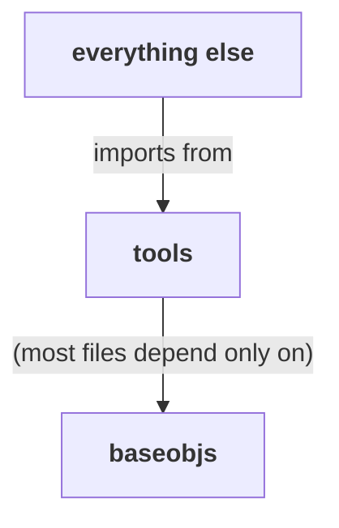

# 07 — Tools library

**Covers:** [pygsti/tools/](../pygsti/tools/).

`tools/` is pyGSTi's de-facto standard library. ~28k lines across ~46 files. Everything else in the codebase imports from it. It also has known structural issues you need to understand *before* editing.

## What lives here

A layered utility library: matrix/basis primitives at the bottom, then quantum-operator transforms, error-generator / Lindblad theory, statistical fit functions, and infrastructure (MPI, shared memory, profiling) sprinkled throughout.

The trouble is that several files in `tools/` are not utilities at all — they're complete domain features that drift into the tools subpackage because they had no other obvious home. Those are flagged below.

## Mental model

### 1. Tools is **layered**, but not enforced

Read top-down (top = depends on nothing below it):

- **Primitives**: linear algebra (`matrixtools.py`), basis manipulation (`basistools.py`), GF(2) arithmetic (`matrixmod2.py`), simple list/slice helpers (`listtools.py`, `slicetools.py`, `typeddict.py`, `nameddict.py`).
- **Quantum operator tools**: channel/operator conversions (`optools.py`), gate construction (`gatetools.py`), standard-gate definitions (`internalgates.py`), Jamiolkowski isomorphism (`jamiolkowski.py`).
- **Error generators / Lindblad**: `lindbladtools.py`, `errgenproptools.py` (~9k lines — huge), `leakage.py` (misplaced — see below).
- **Statistical**: `likelihoodfns.py`, `chi2fns.py` (these wrap or duplicate logic in `objectivefns/` — see misplacement table).
- **Convex / SDP** (cvxpy-optional): `sdptools.py`, parts of `optools.py` and `jamiolkowski.py`.
- **Experiment-design helpers**: `edesigntools.py` (misplaced).
- **Randomized benchmarking**: `rbtools.py`, `rbtheory.py` (the latter misplaced — depends on `models`).
- **Infrastructure**: `mpitools.py`, `mptools.py`, `sharedmemtools.py`, `locking.py`, `profile.py`, `metaprogramming.py`, `pdftools.py`, `tqdm.py`, `legacytools.py`.
- **Group theory / Clifford**: `symplectic.py` (~2k lines), `group.py`, `compilationtools.py`.
- **FOGI / diagnostics**: `fogitools.py`, `mcfetools.py`.
- **Misc**: `dataframetools.py` (pandas helpers), `exceptions.py`, `hypothesis.py`, `opttools.py`.

Cython kernels: `fastcalc.pyx` (general fast math), `fasterrgencalc.pyx` (error-generator hot paths).

### 2. Several files are misplaced domain features, not utilities

These files import "upward" from `models`, `protocols`, `report`, etc. — a layering violation. Don't add new code to them; if you find yourself wanting to, that's a signal the new code probably belongs in the destination subpackage.

| File | Should live in | Why |
|---|---|---|
| [`leakage.py`](../pygsti/tools/leakage.py) | `pygsti.leakage` (planned) | Complete domain feature: leaky-qubit Model construction, LAGO gauge optimization, leakage report generation. Imports from `models`, `modelmembers`, `protocols`, `report`. |
| [`chi2fns.py`](../pygsti/tools/chi2fns.py) | `objectivefns/` | Thin wrappers over logic in `objectivefns`. Some functions are `@deprecate`d in favor of the class-based interface. |
| [`likelihoodfns.py`](../pygsti/tools/likelihoodfns.py) | `objectivefns/` | Same shape as `chi2fns.py`. |
| [`rbtheory.py`](../pygsti/tools/rbtheory.py) | `algorithms/` or `extras/` | RB-specific theory; depends on `models`. |
| [`edesigntools.py`](../pygsti/tools/edesigntools.py) | adjacent to `protocols/` | Fisher information for experiment design; imports `protocols`. |

Cross-link to [known-debt.md #1](known-debt.md#1-tools-misplacement-and-namespace-pollution) and [known-debt.md #2](known-debt.md#2-toolsleakagepy--pygstileakage-move) for the consolidated debt entries and tracker links.

### 3. No `__all__`, no namespace discipline

Not a single module in `tools/` defines `__all__`. `tools/__init__.py` does `from .X import *` for every file, so `pygsti.tools.*` is an undifferentiated blob: every public name from every file is exported, with no curation.

Practical consequence: you can't tell what's actually part of the public API without reading every file. Deprecating names is harder than it should be because it's hard to confirm nothing internal depends on them.

If you're writing new utilities, **add an `__all__`** to your file, even if the rest of `tools/` doesn't. It's the only place a future deprecation effort has to start from.

## Categorized survey (high-value files)

| Category | Files | Notes |
|---|---|---|
| Linear algebra / matrix ops | [matrixtools.py](../pygsti/tools/matrixtools.py), [matrixmod2.py](../pygsti/tools/matrixmod2.py) | `matrixtools.py` is the BLAS-wrapper / gram-matrix / `expm`-tolerance backbone. |
| Basis manipulation | [basistools.py](../pygsti/tools/basistools.py) | Pauli / Gell-Mann / std conversions. |
| Quantum operators & gates | [optools.py](../pygsti/tools/optools.py), [gatetools.py](../pygsti/tools/gatetools.py), [internalgates.py](../pygsti/tools/internalgates.py) | `optools.py` (~2.8k lines) is the channel-rep conversion library: std ↔ superop ↔ Choi, CP/TP checks. |
| Error generators / Lindblad | [errgenproptools.py](../pygsti/tools/errgenproptools.py) (~9k lines), [lindbladtools.py](../pygsti/tools/lindbladtools.py) | `errgenproptools.py` is the BCH / matrix-exponential / error-generator-propagation backbone. Requires `stim` for some functions. |
| Statistical fit functions | [likelihoodfns.py](../pygsti/tools/likelihoodfns.py), [chi2fns.py](../pygsti/tools/chi2fns.py) | Misplaced (see above). Prefer the class-based interfaces in `objectivefns/`. |
| Convex / SDP (cvxpy-optional) | [sdptools.py](../pygsti/tools/sdptools.py), parts of [jamiolkowski.py](../pygsti/tools/jamiolkowski.py), parts of [optools.py](../pygsti/tools/optools.py) | All guarded by `try: import cvxpy`. |
| Experiment design | [edesigntools.py](../pygsti/tools/edesigntools.py) | Fisher information; misplaced. |
| Randomized benchmarking | [rbtools.py](../pygsti/tools/rbtools.py), [rbtheory.py](../pygsti/tools/rbtheory.py) | `rbtheory.py` misplaced. |
| Group theory / Clifford / stabilizer | [symplectic.py](../pygsti/tools/symplectic.py) (~2k lines), [group.py](../pygsti/tools/group.py), [compilationtools.py](../pygsti/tools/compilationtools.py) | Symplectic-tableau geometry for stabilizer-friendly Clifford code. |
| Infrastructure | [mpitools.py](../pygsti/tools/mpitools.py) (~1.4k lines), [mptools.py](../pygsti/tools/mptools.py), [sharedmemtools.py](../pygsti/tools/sharedmemtools.py), [locking.py](../pygsti/tools/locking.py), [profile.py](../pygsti/tools/profile.py), [metaprogramming.py](../pygsti/tools/metaprogramming.py) | Parallel-processing, shared-memory, profiling helpers. |
| Tagged data containers | [nameddict.py](../pygsti/tools/nameddict.py), [typeddict.py](../pygsti/tools/typeddict.py) | Dict variants used throughout pyGSTi for structured key/value data. |
| Slicing / list helpers | [slicetools.py](../pygsti/tools/slicetools.py), [listtools.py](../pygsti/tools/listtools.py) | Clean utilities; no cross-package coupling. |
| Cython hot paths | [fastcalc.pyx](../pygsti/tools/fastcalc.pyx), [fasterrgencalc.pyx](../pygsti/tools/fasterrgencalc.pyx) | Compiled-at-install C extensions for inner loops. |
| Deprecation infrastructure | [legacytools.py](../pygsti/tools/legacytools.py) | `@deprecate` decorator; reused across the codebase. |
| Misc | [pdftools.py](../pygsti/tools/pdftools.py), [dataframetools.py](../pygsti/tools/dataframetools.py), [hypothesis.py](../pygsti/tools/hypothesis.py), [opttools.py](../pygsti/tools/opttools.py), [tqdm.py](../pygsti/tools/tqdm.py), [exceptions.py](../pygsti/tools/exceptions.py), [fogitools.py](../pygsti/tools/fogitools.py), [mcfetools.py](../pygsti/tools/mcfetools.py) | One-off helpers and diagnostics. |

**If you're starting cold:** read [matrixtools.py](../pygsti/tools/matrixtools.py) → [basistools.py](../pygsti/tools/basistools.py) → [optools.py](../pygsti/tools/optools.py) first. Those three account for an outsized fraction of the entry points you'll encounter elsewhere in the codebase.

## Cross-subpackage relationships

`tools/` is *consumed by* essentially every other subpackage. Its outbound dependencies should be `baseobjs` only — and for most files they are. The misplaced files are the violations.

Reading arrows as **"uses"**:

Misplaced files (which violate the above layering):

| File | Imports upward into |
|---|---|
| `tools/leakage.py` | `models`, `modelmembers`, `protocols`, `report` *(heavy)* |
| `tools/chi2fns.py` | `objectivefns` |
| `tools/likelihoodfns.py` | `objectivefns` |
| `tools/rbtheory.py` | `models` |
| `tools/edesigntools.py` | `baseobjs`, `protocols` |
| `tools/optools.py` | `baseobjs`, `modelmembers` *(borderline)* |

All other `tools/` files import from `baseobjs` (or stdlib/numpy/scipy) and nothing else — the way it should be.

## Optional-dep landmines

- **`cvxpy`** is required by [sdptools.py](../pygsti/tools/sdptools.py), parts of [jamiolkowski.py](../pygsti/tools/jamiolkowski.py), and parts of [optools.py](../pygsti/tools/optools.py). All try-import-guarded; missing cvxpy = those functions raise informatively or return `None`. Cross-link [AGENTS.md cross-cutting](AGENTS.md#optional-dependencies).
- **`stim`** is required by some [errgenproptools.py](../pygsti/tools/errgenproptools.py) entry points. Without `stim` you can still use the non-Stim parts.

## Pitfalls and gotchas

- **Don't add code to misplaced files.** If your change lives most naturally in `tools/leakage.py`, `tools/chi2fns.py`, `tools/likelihoodfns.py`, `tools/rbtheory.py`, or `tools/edesigntools.py` — that's a sign the surrounding migration is what should happen instead. At minimum, surface the question to maintainers.

- **`legacytools.py::@deprecate` is the canonical pattern for in-place deprecation.** When you deprecate a function, decorate it with `@_deprecated_fn("use X instead")` from `pygsti.tools.legacytools.deprecate`. The warning class is `pyGSTiDeprecationWarning`.

- **No `__all__` → import * pollution.** When refactoring `tools/`, add `__all__` to any file you touch. Future cleanup work will thank you.

- **Cython kernels.** `fastcalc.so` and `fasterrgencalc.so` are compiled at install time. If they didn't build, some callers fall back to Python implementations (others fail loudly, depending on the call site). Don't assume the Python paths are uniformly slower — the parallel finding for the evotype `_slow` modules ([#713](https://github.com/sandialabs/pyGSTi/issues/713)) shows the compiled-vs-Python relationship can flip based on workload, and the same may or may not hold here. If `tools/` performance surprises you in either direction, first check whether the `.so` actually loaded.

- **`errgenproptools.py` is huge (~9k lines).** Don't refactor it casually. It's the math backbone for error-generator propagation work; subtle changes have correctness implications.

## Architectural debt

- [Tools misplacement and namespace pollution](known-debt.md#1-tools-misplacement-and-namespace-pollution).
- [`leakage.py` → `pygsti.leakage` move](known-debt.md#2-toolsleakagepy--pygstileakage-move).
- [`chi2fns.py` deprecated function names](known-debt.md#7-toolschi2fnspy-deprecated-function-names).
- [`LogLOptions`-style parameter bundling](known-debt.md#13-logloptions-style-parameter-bundling-not-yet-implemented) (relevant in `likelihoodfns.py` and `chi2fns.py`).

## Canonical examples

There's no single notebook that exercises `tools/` end-to-end (it's a library, not a feature). The best place to see real usage is the test suite under [test/unit/tools/](../pygsti-repo/test/unit/tools/), which is well-organized and one of the cleaner parts of the test tree.

For specific topics, the notebooks under [docs/markdown/utilities/](../pygsti-repo/docs/markdown/utilities/) cover some of the higher-level helpers.
