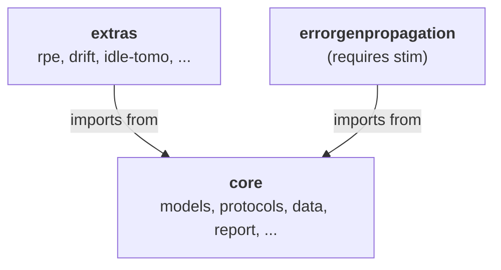

# 08 — Domain plugins

**Covers:** [pygsti/extras/](../pygsti/extras/), [pygsti/errorgenpropagation/](../pygsti/errorgenpropagation/).

## What lives here

- [`extras/`](../pygsti/extras/) — a grab-bag of specialized protocols and characterization tools that sit beside the core GST machinery: robust phase estimation, drift characterization, interpolated gates, and several less-mature efforts. Subdirectory health is highly variable.
- [`errorgenpropagation/`](../pygsti/errorgenpropagation/) — a young (2024) subpackage for computing end-of-circuit error channels via error-generator propagation. Built on `stim`.

## Mental model

### 1. `extras/` is a grab-bag with variable maturity

Subpackages under `extras/` are loosely affiliated with the rest of pyGSTi; some are mature and used in published work, others are stalled or experimental. Treat them individually.

| Subdirectory | Purpose | Status |
|---|---|---|
| [`rpe/`](../pygsti/extras/rpe/) | **Robust Phase Estimation** — protocol for high-precision phase/rotation characterization. | Active. |
| [`drift/`](../pygsti/extras/drift/) | **Drift detection and characterization** via the `StabilityAnalyzer` framework. Time-resolved analysis of gate drift. | Active. |
| [`idletomography/`](../pygsti/extras/idletomography/) | Idle tomography — characterizing idle-channel errors. | **BROKEN — known. Do not introspect, run, or attempt to fix as part of unrelated work.** See [known-debt.md #15](known-debt.md#15-extrasidletomography-is-broken). |
| [`interpygate/`](../pygsti/extras/interpygate/) | Interpolated gate operators — gate-parameter sweeps interpolated from process tomography. | Active, but with deprecated names still exported (`vec`/`unvec`). |
| [`crosstalk/`](../pygsti/extras/crosstalk/) | Multi-qubit crosstalk characterization. | Minimal / underdeveloped. |
| [`lfh/`](../pygsti/extras/lfh/) | Low-Frequency Hamiltonian — slow drift parameterization. | Minimal / underdeveloped. |
| [`paritybenchmarking/`](../pygsti/extras/paritybenchmarking/) | Parity benchmarking — error-disturbance quantification. | Minimal / underdeveloped. |
| [`ibmq/`](../pygsti/extras/ibmq/) | IBM Quantum backend integration. | Experimental. |
| [`devices/`](../pygsti/extras/devices/) | Hardware-device specs (IBMQ, Rigetti, etc.) — ~40 small data files. | Data-only, no logic. |

### 2. `extras/` imports are commented out in `__init__.py`

Open [pygsti/extras/\_\_init\_\_.py](../pygsti/extras/__init__.py): the `from . import drift / rpe / paritybenchmarking` lines are commented out. Result: `import pygsti` does **not** auto-import any `extras/` subdirectory. To use them you must use the full module path: `import pygsti.extras.rpe.rpetools`, not `pygsti.extras.rpetools`.

This signals that the maintainers haven't decided which subdirectories are "officially integrated." Don't assume `pygsti.extras.X` is available after a plain `import pygsti`. See [known-debt.md #8](known-debt.md#8-extras__init__py-imports-commented-out).

### 3. `errorgenpropagation/` is a focused, recent module

[`errorgenpropagation/`](../pygsti/errorgenpropagation/) propagates error generators through a circuit to compute an end-of-circuit error channel. Two files:

- [`errorpropagator.py`](../pygsti/errorgenpropagation/errorpropagator.py) — the `ErrorGeneratorPropagator` class and `eoc_error_channel()` API.
- [`localstimerrorgen.py`](../pygsti/errorgenpropagation/localstimerrorgen.py) — Stim-backed error-label representation and conversions.

Requires `stim` (try-imported with graceful degradation).

This subpackage is too small to spend much time on architecturally. If you need to use it, read the two files; if you need to extend it, the class hierarchy is shallow and the code is recent enough to be readable.

## Key abstractions

| Class / function | File | Role |
|---|---|---|
| `StabilityAnalyzer` | [extras/drift/stabilityanalyzer.py](../pygsti/extras/drift/stabilityanalyzer.py) | Drift-characterization workhorse. |
| RPE protocol + helpers | [extras/rpe/](../pygsti/extras/rpe/) | Robust phase estimation. |
| Interpolated gate API | [extras/interpygate/](../pygsti/extras/interpygate/) | `vec`/`unvec` are deprecated but still exported (see `__init__.py:14`). Use `unvec_square` instead. |
| `ErrorGeneratorPropagator` | [errorgenpropagation/errorpropagator.py](../pygsti/errorgenpropagation/errorpropagator.py) | End-of-circuit error channel via error-generator propagation. |

## Cross-subpackage relationships

Reading arrows as **"uses"**:

`extras/` subpackages depend on the core (`models`, `protocols`, `data`, `report`) but the core does not depend on `extras/`. `errorgenpropagation/` is similarly leaf-positioned.

## Pitfalls and gotchas

- **Do not investigate, run, or attempt to fix `extras/idletomography/`.** The subsystem is known-broken and out of scope for general maintenance work. See [known-debt.md #15](known-debt.md#15-extrasidletomography-is-broken).
- **Full module paths required for `extras/` imports.** `import pygsti.extras.rpe.rpetools` is the form that works; `import pygsti.extras.rpetools` is not (no such module).
- **`extras/interpygate/__init__.py:14`** exports deprecated `vec` and `unvec` for backward compatibility. Use `unvec_square` instead.
- **`errorgenpropagation/` needs `stim`.** If `stim` is missing, expect informative `ImportError`s at function-call time, not at import time (try-imported with a warning).
- **`extras/devices/` is just data files** — not a place to put new code.

## Architectural debt

- [`extras/__init__.py` imports commented out](known-debt.md#8-extras__init__py-imports-commented-out).
- [`extras/idletomography/` is broken](known-debt.md#15-extrasidletomography-is-broken) — related issues: [#711](https://github.com/sandialabs/pyGSTi/issues/711), [#737](https://github.com/sandialabs/pyGSTi/issues/737), [#576](https://github.com/sandialabs/pyGSTi/issues/576).
- `interpygate/` partial deprecation (`vec`/`unvec`).

## Canonical examples

- [docs/markdown/protocols/](../pygsti-repo/docs/markdown/protocols/) — notebooks for several extras-housed protocols: drift characterization, RPE, mirror-circuit benchmarks, parity benchmarking, volumetric benchmarks, interpolated operators.
- [docs/markdown/protocols/DriftCharacterization.md](../pygsti-repo/docs/markdown/protocols/DriftCharacterization.md), [RobustPhaseEstimation.md](../pygsti-repo/docs/markdown/protocols/RobustPhaseEstimation.md), [InterpolatedOperators.md](../pygsti-repo/docs/markdown/protocols/InterpolatedOperators.md).
- **Skip [docs/markdown/protocols/IdleTomography.md](../pygsti-repo/docs/markdown/protocols/IdleTomography.md)** — broken subsystem.
- [docs/markdown/rb/](../pygsti-repo/docs/markdown/rb/) — RB tutorials (the RB Protocol lives in `protocols/rb.py`; supporting analysis can pull from `extras/` and `tools/rbtheory.py`).
